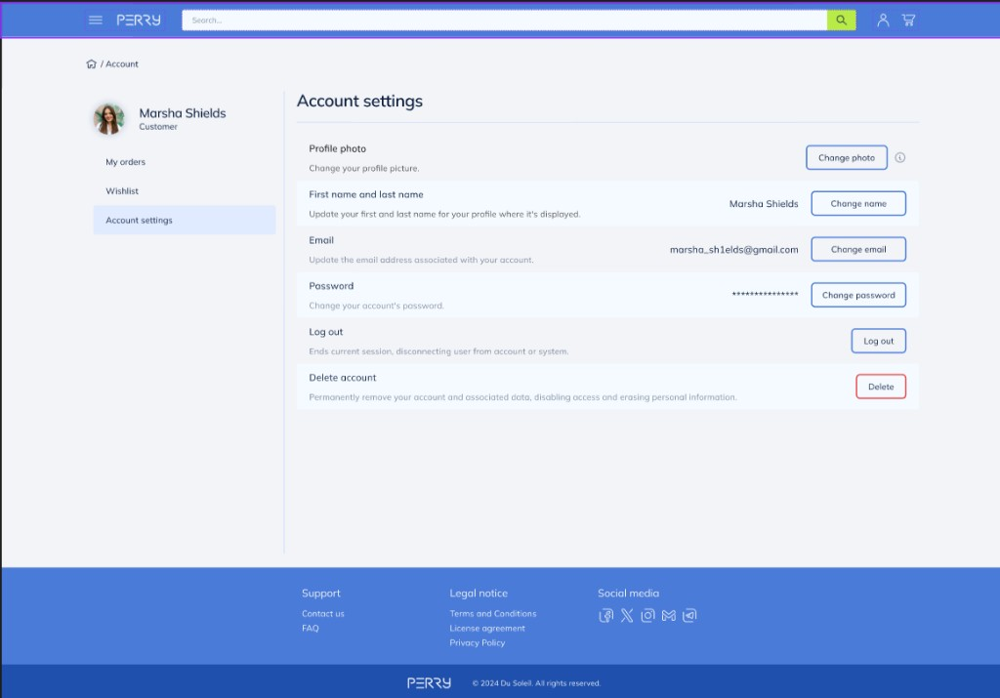

# Perry React storefront (`perry-front`)

Vite + React 19 витрина маркетплейса **Perry**. Визуал по макету **Figma** (приоритет №1) и эталону Razor `site.css` / `auth.css`. Данные — из `Perry.Api` (proxy `/api` → `http://localhost:5272`).

Backend: [Back_end_for_our_poroject](https://github.com/ITSTEP-PERRY/Back_end_for_our_poroject)  
Сводка (каталог/PDP/auth): [docs/ИЗМЕНЕНИЯ-2026-09-17.md](./docs/ИЗМЕНЕНИЯ-2026-09-17.md)  
**Account (Wishlist / Orders / Settings):** [docs/ИЗМЕНЕНИЯ-Account-2026-09-17.md](./docs/ИЗМЕНЕНИЯ-Account-2026-09-17.md)  
Скриншоты Account (14 шт.): [docs/screenshots/README.md](./docs/screenshots/README.md)

---

## Account — что сделано (17.09)

Личный кабинет по макетным скринам:

| Маршрут | Экран |
|---------|--------|
| `/account/orders` | My orders + модалка Details |
| `/account/wishlist` | Wishlist + Remove confirm |
| `/account/settings` | Settings + модалки name/password/email/logout/delete |

- Сайдбар: аватар, Customer/Admin, навигация Account
- Wishlist через API (`WishlistContext`)
- Смена email: пароль + 6-значный код
- Старые `/profile`, `/orders` → редирект на `/account/*`




Полный набор из 14 фото с описаниями — в [docs/screenshots/README.md](./docs/screenshots/README.md).

---

## Что изменено (сводка)

### Витрина под Figma
- Полный порт UI: Home, каталог, PDP, корзина, заказы, профиль, legal-страницы.
- Стили перенесены из Razor: `src/styles/storefront.css`, `src/styles/auth.css`, `src/styles/admin.css`.
- Ant Design ConfigProvider с витрины убран — разметка и классы как в макете/Razor.
- Ассеты: `public/icons/*`, `public/images/home/*`, `SiginSignup.png`.

### Home
- Hero-слайдер, карусели категорий, **Trending deals**, **Sale**.
- CTA-блок **Abundance of goods** (Sign up / Log in) — как в кадре 26 / Figma.

### Каталог `/products` (Figma Product List V2)
- Сайдбар: **Brand**, **Fabric type**, **Size**, **Color**, **Price**, **Customer reviews**.
- Сортировка, grid/list, пагинация, breadcrumbs.
- Fallback-списки брендов/тканей/цветов из макета, если API ещё без facets.
- Адаптив: кнопка Filters на mobile.

### Product page `/products/:id`
- Галерея + бейдж скидки, About product, buy-box.
- Buy-box: Status, **Delivery**, **Payment methods**, **Security**, **Returns**, qty, Buy now / Add to cart, wish list.
- **Customer reviews**: сводка, bars, Frequent tags, Helpful / Translate, See more.
- Карусели по Figma: **You may also like**, **Best sellers in {category}**.

### Auth (экраны 12–25)
| Маршрут | Экран |
|---------|--------|
| `/login` | Welcome back |
| `/register` | Create account → `/finishing-touches` |
| `/verify-code` | Send code (после 3 неудачных логинов) |
| `/forgot-password` | Forgot password |
| `/reset-password` | Reset password |
| `/finishing-touches` | First / Last name |
| `/auth/success` | Congratulations! |

### Legal
- `/terms`, `/privacy`, `/license` — полные тексты + навигация Legal notice.

### Админка React `/admin/*`
- Login, Dashboard, Products (CRUD), Categories (дерево + `description` / `imageUrl` / `iconUrl` / `IsActive`), Orders, Users.

### API-клиент
- `src/api/` — categories, products (facets/filters), auth JWT, cart session, orders.
- Контексты: `AuthContext`, `CartContext`, `RequireAuth`.

### Инфра Vite
- Proxy `/api`, `/uploads` → `:5272`.
- `server.watch.ignored` для `My_Amazon2` / backend — чтобы `dotnet build` не ронял Vite (`EBUSY`).
- `.env.example` с `VITE_API_PROXY`.

---

## Запуск

```bash
# Terminal 1 — API (из backend-репо)
cd My_Amazon2/src/Perry.Api   # или клон Back_end_for_our_poroject
dotnet run --launch-profile http
# Swagger: http://localhost:5272/swagger

# Terminal 2 — React
npm install
npm run dev
# App: http://localhost:3000
```

### Демо
- Админ: `Admin` / `Admin` → `/admin/login`
- Покупатель: `/register`

### Маршруты

| Path | Описание |
|------|----------|
| `/` | Home |
| `/products` | Каталог + фильтры |
| `/products/:id` | PDP |
| `/cart` | Корзина |
| `/account/orders` | My orders (JWT) |
| `/account/wishlist` | Wishlist (JWT) |
| `/account/settings` | Account settings (JWT) |
| `/orders`, `/profile` | Редирект → `/account/*` |
| `/login` … `/auth/success` | Auth-поток |
| `/terms`, `/privacy`, `/license` | Legal |
| `/admin/*` | Админка |

### Notes
- Cart guest: `localStorage.perry_cart_session`
- JWT: `localStorage.perry_token`
- Приоритет дизайна: **Figma** → скриншоты backend README 26–33 → Razor CSS
