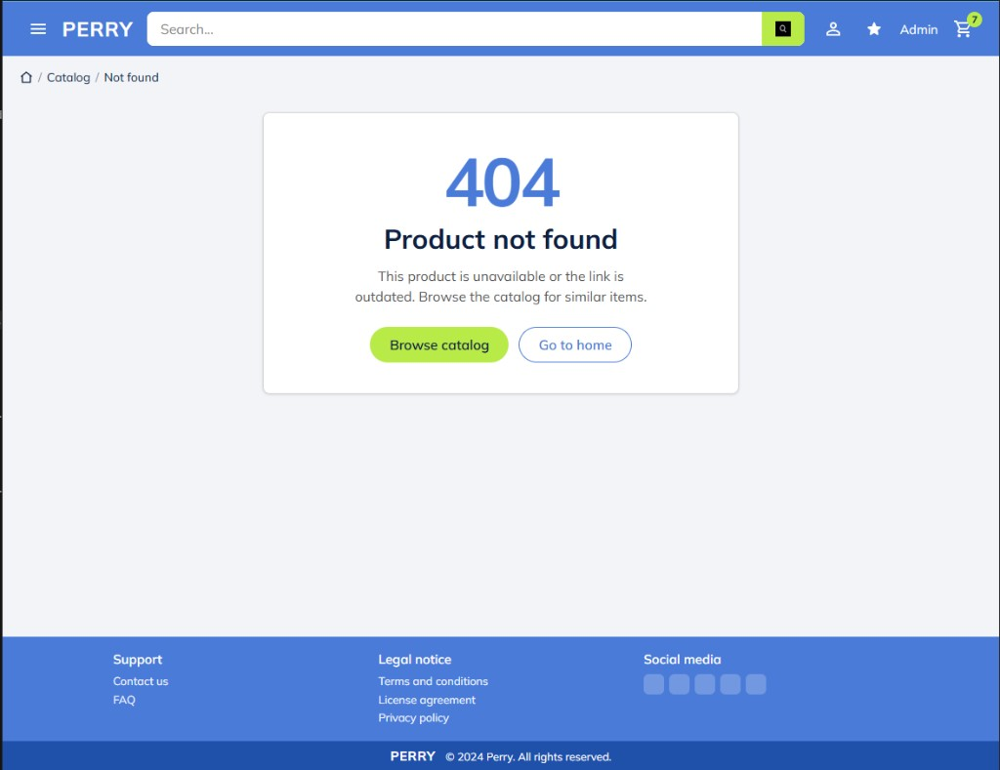
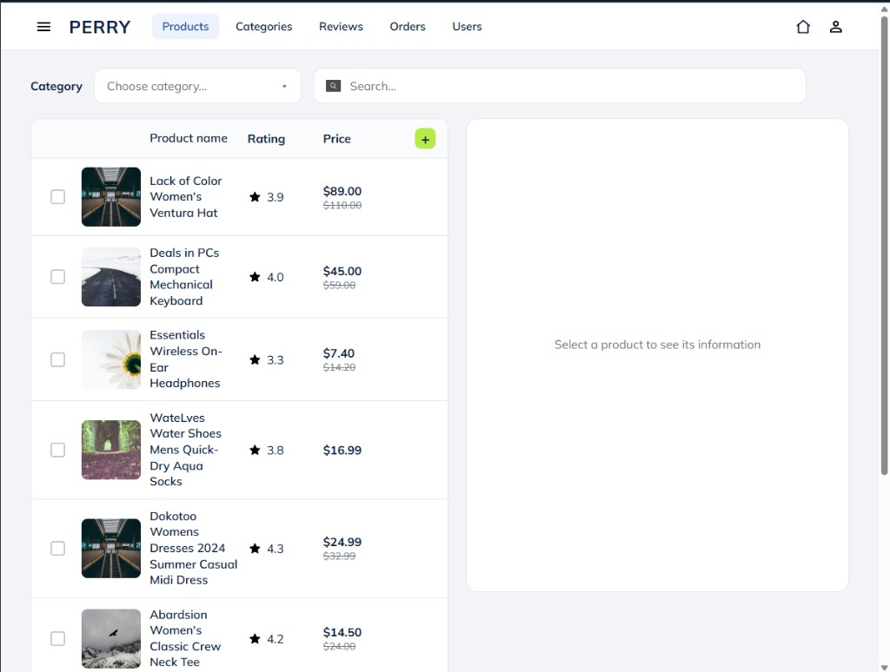
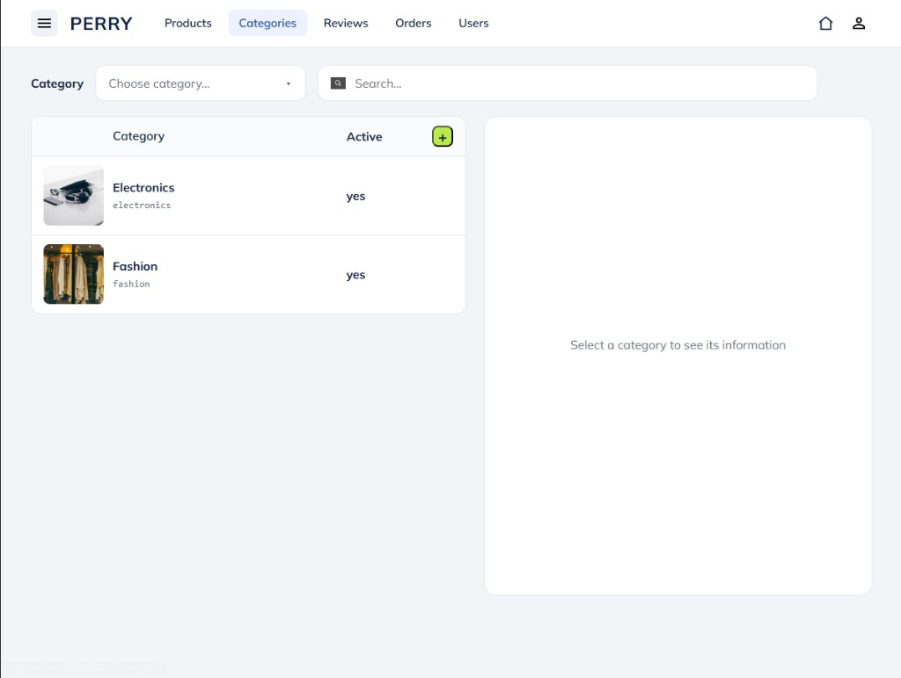
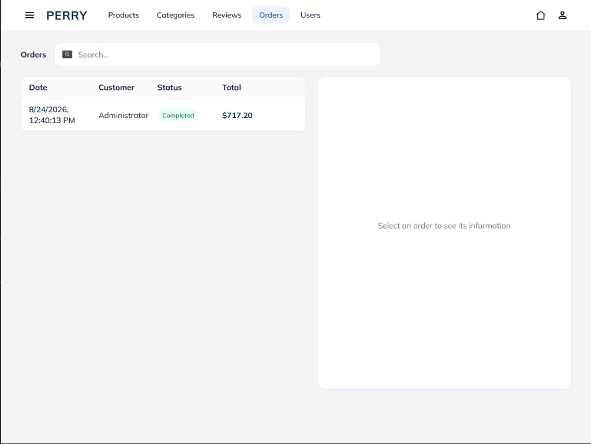
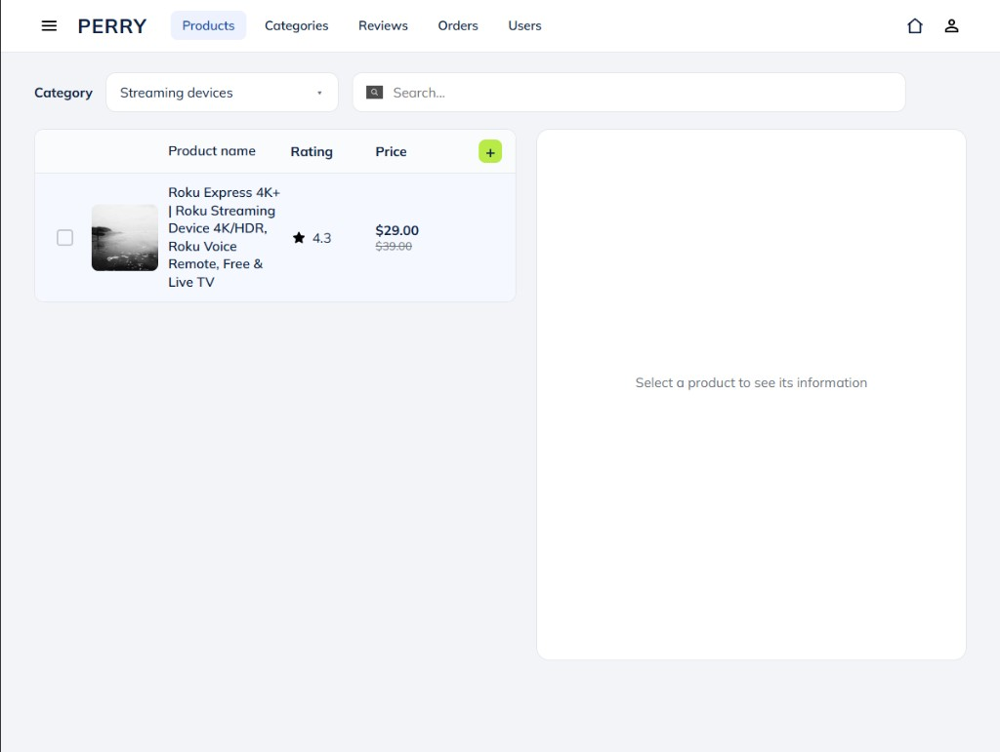
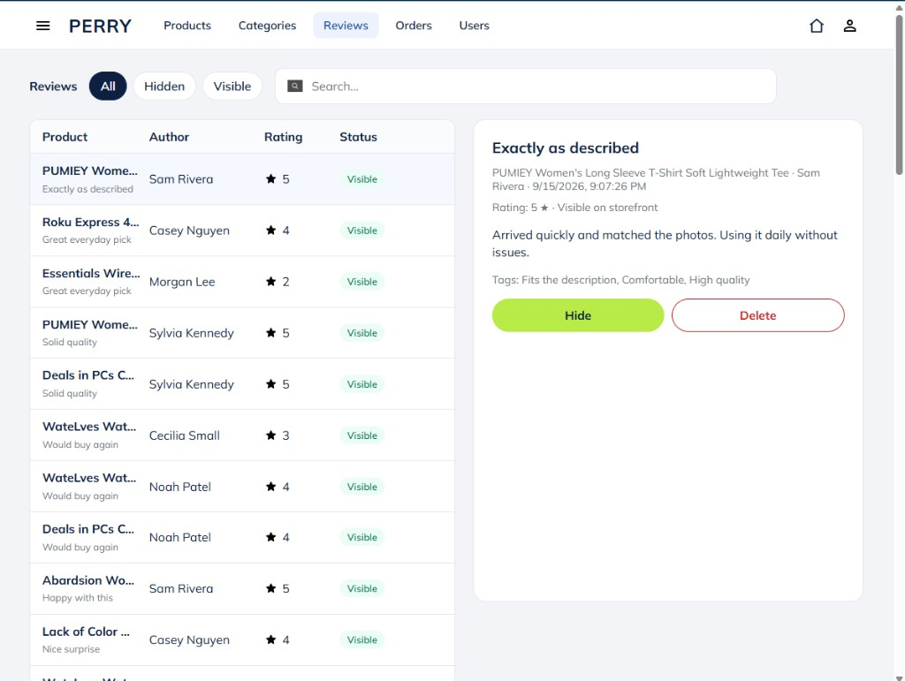
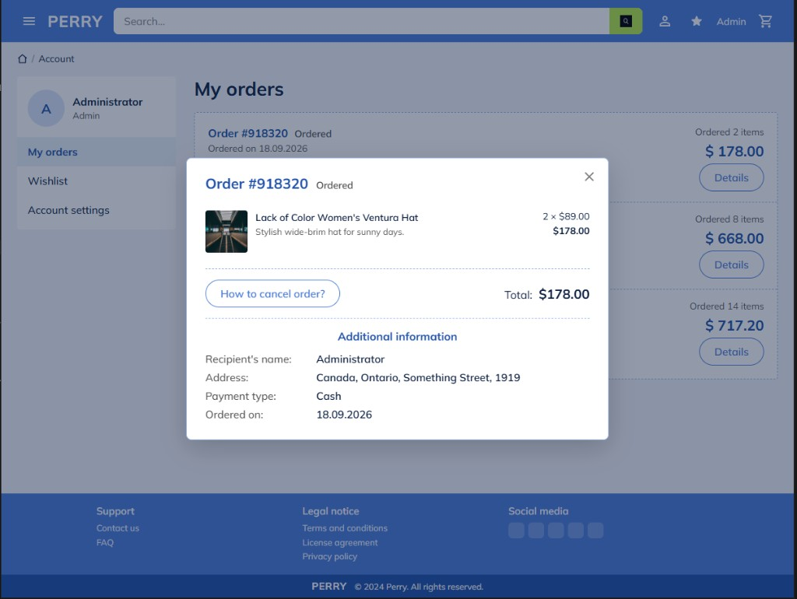
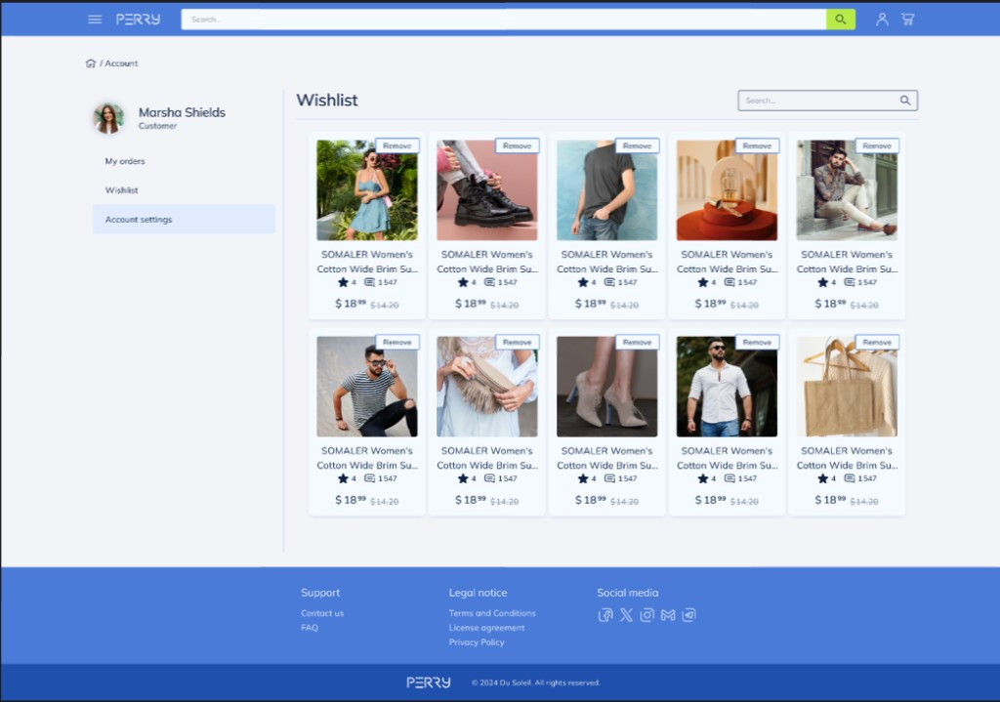
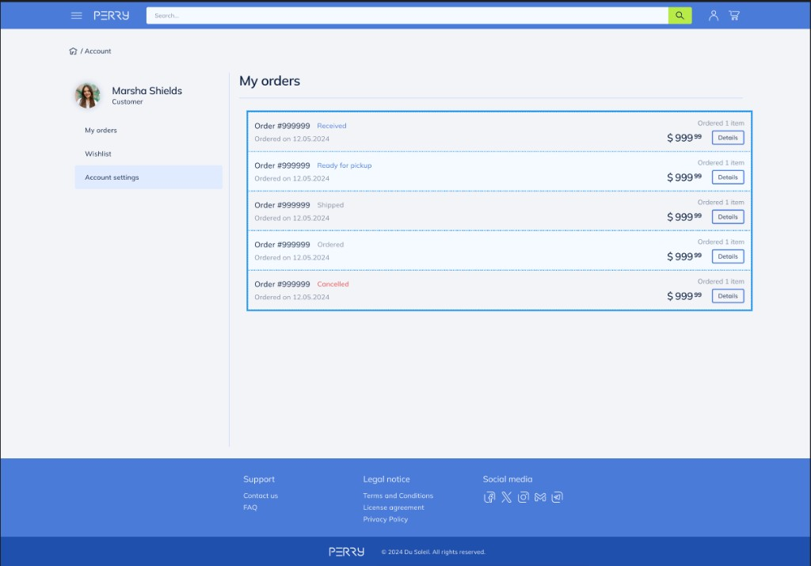

# Perry React storefront (`perry-front`)

## Быстрый запуск — две иконки

| Ярлык | Что запускает | URL |
|-------|----------------|-----|
| **Perry Desktop** | Desktop-витрина (Vite) | http://localhost:3000 |
| **Perry Mobile** | Mobile (Expo Web) | http://localhost:8081 |

После clone один раз:  
`powershell -ExecutionPolicy Bypass -File .\Install-Perry-Shortcuts.ps1`  
(иконки появятся в корне репо и на рабочем столе).

Либо двойной клик по `start-desktop.cmd` / `start-mobile.cmd` (алиасы: `Запуск-Desktop.cmd` / `Запуск-Mobile.cmd`).  
Нужен **Perry.Api** на `:5272`. Подробнее: [docs/инструкции/КАК-ЗАПУСКАТЬ.md](./docs/инструкции/КАК-ЗАПУСКАТЬ.md).

**Отчёт 01.10.2026 (mobile Figma 1:1 + backend):** [docs/журнал/2026-10-01.md](./docs/журнал/2026-10-01.md)  
**Отчёт 02.10.2026 (DummyJSON — фото витрин):** [docs/журнал/2026-10-02.md](./docs/журнал/2026-10-02.md)  
**Как залить фото у себя:** [docs/инструкции/НАПОЛНЕНИЕ-ФОТО-DUMMYJSON.md](./docs/инструкции/НАПОЛНЕНИЕ-ФОТО-DUMMYJSON.md)
**Как залить фото у себя:** [docs/инструкции/НАПОЛНЕНИЕ-ФОТО-DUMMYJSON.md](./docs/инструкции/НАПОЛНЕНИЕ-ФОТО-DUMMYJSON.md)

---

Vite + React 19 витрина маркетплейса **Perry**. Визуал по макету **Figma** (приоритет №1) и эталону Razor `site.css` / `auth.css`. Данные — из `Perry.Api` (proxy `/api` → `http://localhost:5272`).

**Mobile (Expo):** папка [`mobile/`](./mobile/) · [README](./mobile/README.md) · план [docs/продукт/МОБИЛЬНОЕ-ПРИЛОЖЕНИЕ-REACT.md](./docs/продукт/МОБИЛЬНОЕ-ПРИЛОЖЕНИЕ-REACT.md) · решение [docs/продукт/РЕШЕНИЕ-MOBILE-С-КОДОМ.md](./docs/продукт/РЕШЕНИЕ-MOBILE-С-КОДОМ.md)

Backend: [Back_end_for_our_poroject](https://github.com/ITSTEP-PERRY/Back_end_for_our_poroject)  
**Figma-перепись 30.09 (~22 экрана):** [docs/журнал/2026-09-30-figma-rewrite.md](./docs/журнал/2026-09-30-figma-rewrite.md) · [чеклист](./docs/продукт/FIGMA-REWRITE-CHECKLIST.md)  
**Хроника всей работы:** [docs/ХРОНИКА-РАБОТЫ.md](./docs/ХРОНИКА-РАБОТЫ.md) · оглавление [docs/README.md](./docs/README.md)  
**Trello (карточки):** [docs/инструкции/TRELLO-TODO.md](./docs/инструкции/TRELLO-TODO.md) · доска [ITSTEP-PERRY](https://trello.com/b/bwEYs3Kq/itstep-perry)  
**Отчёт 28.09 (весь день):** [docs/журнал/2026-09-28.md](./docs/журнал/2026-09-28.md) · срезы: [#A03–#A07](./docs/журнал/2026-09-28-a03-a07.md) · [#95 Auth](./docs/журнал/2026-09-28-auth-95.md) · [отзывы #99–#104](./docs/продукт/ОТЗЫВЫ-ПОКУПАТЕЛЕЙ.md)  
**Стыки микросервисов (для команды):** [docs/стыки/СТЫКИ-МИКРОСЕРВИСОВ.md](./docs/стыки/СТЫКИ-МИКРОСЕРВИСОВ.md) · **решение с кодом:** [docs/стыки/РЕШЕНИЕ-СТЫКОВ-С-КОДОМ.md](./docs/стыки/РЕШЕНИЕ-СТЫКОВ-С-КОДОМ.md) · **в Telegram:** [docs/стыки/СООБЩЕНИЕ-В-ЧАТ-СТЫКИ.md](./docs/стыки/СООБЩЕНИЕ-В-ЧАТ-СТЫКИ.md) · [docs/стыки/AUTH-INTEGRATION.md](./docs/стыки/AUTH-INTEGRATION.md)  
**Админка:** [docs/продукт/НАША-АДМИНКА.md](./docs/продукт/НАША-АДМИНКА.md) · [docs/продукт/РЕШЕНИЕ-ФРОНТ-АДМИН.md](./docs/продукт/РЕШЕНИЕ-ФРОНТ-АДМИН.md)  
**Срез 26.09 (#94 Auth / без Users):** [docs/журнал/2026-09-26.md](./docs/журнал/2026-09-26.md) · [docs/журнал/2026-09-26-срез.md](./docs/журнал/2026-09-26-срез.md) · [docs/стыки/AUTH-INTEGRATION.md](./docs/стыки/AUTH-INTEGRATION.md) · [docs/стыки/ВОПРОСЫ-КОМАНДЕ.md](./docs/стыки/ВОПРОСЫ-КОМАНДЕ.md) · [docs/продукт/ADMIN-КОМАНДА.md](./docs/продукт/ADMIN-КОМАНДА.md)  
**Срез 25.09 (lightbox / auth tokens / orders stats):** [docs/журнал/2026-09-25.md](./docs/журнал/2026-09-25.md) · [docs/журнал/2026-09-25-orders-stats.md](./docs/журнал/2026-09-25-orders-stats.md)  
**Спринт 19.09:** [docs/журнал/2026-09-19.md](./docs/журнал/2026-09-19.md) · скрины [docs/screenshots/sprint-2026-09-19/](./docs/screenshots/sprint-2026-09-19/README.md)  
Сводка (каталог/PDP/auth): [docs/журнал/2026-09-17.md](./docs/журнал/2026-09-17.md)  
**Account:** [docs/продукт/ACCOUNT-КАБИНЕТ.md](./docs/продукт/ACCOUNT-КАБИНЕТ.md) · [docs/журнал/2026-09-17-account.md](./docs/журнал/2026-09-17-account.md)  
Скриншоты: [docs/screenshots/README.md](./docs/screenshots/README.md)

---

## Срез 30.09.2026 — перепись ~22 экранов под Figma

Закрыта перепись витрины и админки под канон **Figma Prototype**: Home, каталог, PDP, auth-flow, cart/checkout, legal, 404, account, admin (~22 уникальных экрана + состояния/модалки). Чеклист закрыт.

| Документ | О чём |
|----------|--------|
| **[ОТЧЁТ-FIGMA-REWRITE-2026-09-30.md](./docs/журнал/2026-09-30-figma-rewrite.md)** | **Отчёт: что сделано по 22 экранам** |
| [FIGMA-REWRITE-CHECKLIST.md](./docs/продукт/FIGMA-REWRITE-CHECKLIST.md) | Чеклист экранов (все 🟢) |
| [FIGMA-PAGE-INVENTORY.md](./docs/продукт/FIGMA-PAGE-INVENTORY.md) | Инвентарь node-id макета |

Ветка: `feature/figma-storefront-port`.

---

## Срез 28.09.2026 — итог дня (#A03–#A07 · #95 · #99–#104)

Полный отчёт: [ОТЧЁТ-2026-09-28.md](./docs/журнал/2026-09-28.md).

| Блок | Что |
|------|-----|
| **#A03–#A07** | Seed orders · ReviewController · checkout address/payment · `/api/health` · popular-by-user · CI green |
| **#95** | JWT HS256 secret от Auth → Product валидирует подпись (`.env`, не в git) |
| **#99–#104** | Create `POST /api/reviews` · AuthClaims UserId · unique · `GET /me` · Account «My reviews» · tags |
| Auth next | **#96** iss/aud · **#97** credential · **#98** claims |

Backend: `feature/categories-facets-figma-storefront` в [Back_end_for_our_poroject](https://github.com/ITSTEP-PERRY/Back_end_for_our_poroject). Front: `feature/figma-storefront-port`.

---

## Срез 26.09.2026 — Auth / без Users (#94)

| # | Что |
|---|-----|
| **#94** | Product API: удалены `Users`/`UserAccesses`/`UserRoles`, FK; только `UserId` из JWT Auth Service |
| **#95** | Карточка Владу: JWT claims / issuer / Internal API ([Trello](https://trello.com/c/T28F0b7e)) |
| FE | `VITE_AUTH_API_URL` + `authApi`/`usersApi` → Auth Service; каталог/корзина — Product |

Подробнее: [ОТЧЁТ-2026-09-26.md](./docs/журнал/2026-09-26-срез.md), [ИЗМЕНЕНИЯ-2026-09-26.md](./docs/журнал/2026-09-26.md), [AUTH-INTEGRATION.md](./docs/стыки/AUTH-INTEGRATION.md), [ВОПРОСЫ-КОМАНДЕ.md](./docs/стыки/ВОПРОСЫ-КОМАНДЕ.md), [СВЕСТИ-ДВЕ-ЛИНИИ.md](./docs/продукт/СВЕСТИ-ДВЕ-ЛИНИИ.md).

---

## Срез 25.09.2026 — что сделано

Кратко по закрытым карточкам и коду (ветка `feature/figma-storefront-port`). Полные тексты: [ИЗМЕНЕНИЯ-2026-09-25.md](./docs/журнал/2026-09-25.md), [ИЗМЕНЕНИЯ-2026-09-25-orders-stats.md](./docs/журнал/2026-09-25-orders-stats.md).

| # | Что |
|---|-----|
| **#41 / #43** | Общий `ImageLightbox` — fullscreen фото на PDP и в отзывах |
| **#32** | Empty state каталога (поиск/фильтры без результатов) |
| **#62** | SVG-иконки соцсетей в футере |
| **#16** | Secure Forgot — единый ответ без раскрытия email |
| **#73** | Cart API без `?userId=` (только JWT / sessionId) |
| **#93** | **Admin Orders:** статусы Ordered / Received / Shipped / ReadyToPickup / Cancelled / Returned; фильтры status + даты + orderId; `statusCounts`, `totalAmount`, `totalOrderCompare` / `totalAmountCompare` |

**Admin Orders (#93)** — экран `/admin/orders`: поиск по orderId, фильтр статуса, диапазон дат / «This month», чипы количества по статусам, % сравнения с предыдущим периодом.

Backend-пара: [Back_end_for_our_poroject](https://github.com/ITSTEP-PERRY/Back_end_for_our_poroject) (`AuthTokens` #15, admin orders API #93).

---

## Спринт к защите — что сделано (19.09)

Закрыты оставшиеся карточки Trello (кроме Backlog #73): PDP reviews + инфо-модалки + notify + 404 · React-админка Categories / Products / Reviews / Users / Orders · Docker · Swagger · SMTP-гайд · mobile Done.

Текстовая сводка: [docs/журнал/2026-09-19.md](./docs/журнал/2026-09-19.md)

### 01 · 404 Product not found



Товар не найден — Browse catalog / Go to home.

### 02 · Admin Products



Список товаров + фильтр Category / Search.

### 03 · Admin Categories



Корневые категории, Active, создание «+».

### 04 · Admin Reviews


Модерация: All / Hidden / Visible.

### 05 · Admin Orders



Список заказов Date / Customer / Status / Total.

### 07 · Admin Products — category dropdown


Иерархия категорий в тулбаре.

### 08 · Admin Products — фильтр Streaming



Отфильтрованный список (Roku Express 4K+).

### 09 · Admin Users — Active


Активные пользователи, ellipsis на длинных email.

### 10 · Admin Orders — детали


Состав заказа + смена Status.

### 11 · Admin Reviews — Hide



Скрыть отзыв с витрины (Hide / Delete).

### 12 · Account — My orders


Кабинет: заказы Ordered / Ready for pickup.

### 14 · Account — Order details


Модалка: позиции, Total, How to cancel.

### 15 · Account — Order details #2



Второй заказ (#918320), Total $178.

### 16 · Account — Change email


Смена email: пароль + 6-digit code + Send code.

---

## Account — что сделано (17.09)

Личный кабинет по макетным скринам:

| Маршрут | Экран |
|---------|--------|
| `/account/orders` | My orders + модалка Details |
| `/account/wishlist` | Wishlist + Remove confirm |
| `/account/settings` | Settings + модалки name/password/email/logout/delete |

- Сайдбар: аватар, Customer/Admin, навигация Account
- Wishlist через API (`WishlistContext`)
- Смена email: пароль + 6-значный код
- Старые `/profile`, `/orders` → редирект на `/account/*`






Полный набор из 14 фото с описаниями — в [docs/screenshots/README.md](./docs/screenshots/README.md).

---

## Что изменено (сводка)

### Витрина под Figma
- Полный порт UI: Home, каталог, PDP, корзина, заказы, профиль, legal-страницы.
- Стили перенесены из Razor: `src/styles/storefront.css`, `src/styles/auth.css`, `src/styles/admin.css`.
- Ant Design ConfigProvider с витрины убран — разметка и классы как в макете/Razor.
- Ассеты: `public/icons/*`, `public/images/home/*`, `SiginSignup.png`.

### Home
- Hero-слайдер, карусели категорий, **Trending deals**, **Sale**.
- CTA-блок **Abundance of goods** (Sign up / Log in) — как в кадре 26 / Figma.

### Каталог `/products` (Figma Product List V2)
- Сайдбар: **Brand**, **Fabric type**, **Size**, **Color**, **Price**, **Customer reviews**.
- Сортировка, grid/list, пагинация, breadcrumbs.
- Fallback-списки брендов/тканей/цветов из макета, если API ещё без facets.
- Адаптив: кнопка Filters на mobile.

### Product page `/products/:id`
- Галерея + бейдж скидки, About product, buy-box.
- Buy-box: Status, **Delivery**, **Payment methods**, **Security**, **Returns**, qty, Buy now / Add to cart, wish list.
- **Customer reviews**: сводка, bars, Frequent tags, Helpful / Translate, See more.
- Карусели по Figma: **You may also like**, **Best sellers in {category}**.

### Auth (экраны 12–25)
| Маршрут | Экран |
|---------|--------|
| `/login` | Welcome back |
| `/register` | Create account → `/finishing-touches` |
| `/verify-code` | Send code (после 3 неудачных логинов) |
| `/forgot-password` | Forgot password |
| `/reset-password` | Reset password |
| `/finishing-touches` | First / Last name |
| `/auth/success` | Congratulations! |

### Legal
- `/terms`, `/privacy`, `/license` — полные тексты + навигация Legal notice.

### Админка React `/admin/*` (обновлено 19.09)
- Login, Dashboard, Products (список + create/edit), Categories (CRUD + inactive), **Reviews** (Hide/Approve/Delete), Orders, Users (Active/Deleted + restore).

### API-клиент
- `src/api/` — categories, products (facets/filters), auth JWT, cart session, orders.
- Контексты: `AuthContext`, `CartContext`, `RequireAuth`.

### Инфра Vite
- Proxy `/api`, `/uploads` → `:5272`.
- `server.watch.ignored` для `My_Amazon2` / backend — чтобы `dotnet build` не ронял Vite (`EBUSY`).
- `.env.example` с `VITE_API_PROXY`.

---

## Запуск

```bash
# Terminal 1 — API (из backend-репо)
cd My_Amazon2/src/Perry.Api   # или клон Back_end_for_our_poroject
dotnet run --launch-profile http
# Swagger: http://localhost:5272/swagger

# Terminal 2 — React
npm install
npm run dev
# App: http://localhost:3000
```

### Демо
- Админ: `Admin` / `Admin` → `/admin/login`
- Покупатель: `/register`

### Маршруты

| Path | Описание |
|------|----------|
| `/` | Home |
| `/products` | Каталог + фильтры |
| `/products/:id` | PDP |
| `/cart` | Корзина |
| `/account/orders` | My orders (JWT) |
| `/account/wishlist` | Wishlist (JWT) |
| `/account/settings` | Account settings (JWT) |
| `/orders`, `/profile` | Редирект → `/account/*` |
| `/login` … `/auth/success` | Auth-поток |
| `/terms`, `/privacy`, `/license` | Legal |
| `/admin/*` | Админка |

### Notes
- Cart guest: `localStorage.perry_cart_session`
- JWT: `localStorage.perry_token`
- Приоритет дизайна: **Figma** → скриншоты backend README 26–33 → Razor CSS
