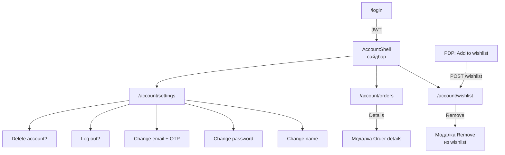

# Личный кабинет Account (Wishlist / My orders / Settings)

Пользовательский сценарий: **что появляется, когда**, и **что делать** в каждом экране.  
Ниже — макеты из [`screenshots/account/`](./screenshots/account/) рядом с описанием шагов и тем, **как это работает в коде**.

Стек витрины Account (React, не Razor):
- FE: http://localhost:3000 — маршруты `/account/*`
- BE: http://localhost:5272 — JWT API (`/api/wishlist`, `/api/orders`, `/api/auth/me…`)

Связанные страницы (React):
- `/account/wishlist` — Wishlist  
- `/account/orders` — My orders (+ модалка Details)  
- `/account/settings` — Account settings (модалки name / password / email / logout / delete)

Код FE:
- `src/widgets/layout/AccountShell.tsx` — сайдбар + breadcrumbs  
- `src/pages/account/AccountWishlistPage.tsx`  
- `src/pages/account/AccountOrdersPage.tsx`  
- `src/widgets/OrderDetailsModal.tsx`  
- `src/pages/account/AccountSettingsPage.tsx`  
- `src/app/WishlistContext.tsx`, `src/api/index.ts` (`wishlistApi`, `ordersApi`, `authApi`)

Код BE (`Perry.Api`):
- `WishlistController` — GET/POST/DELETE `/api/wishlist`  
- `OrdersController` — GET `/api/orders`, GET `/api/orders/{id}`, POST checkout  
- `AuthController` — PUT `/api/auth/me`, password, email OTP, DELETE `/api/auth/me`

Макеты: [`screenshots/account/01`–`14`](./screenshots/account/).  
Краткий индекс кадров: [screenshots/README.md](./screenshots/README.md) (секция A01–A14).

---

## 1. Карта сценариев (кратко)



**Доступ:** все `/account/*` за `RequireAuth`. Без токена → `/login` (с `state.from`).

---

## 2. Общая оболочка кабинета

На каждом экране Account пользователь видит:

| Элемент | Назначение |
|---------|------------|
| Breadcrumbs Home / Account | Навигация на витрину |
| Сайдбар: аватар, имя, роль (Customer / Admin) | Кто вошёл |
| Ссылки **My orders** / **Wishlist** / **Account settings** | Переключение разделов |
| Контент справа | Страница раздела |

Вход в кабинет: иконка Account в header → `/account/orders` (или меню ☰ → Account settings / Wishlist).

---

## 3. Wishlist (избранное)

### Когда пользователю это нужно

Сохранить товары «на потом», быстро открыть их снова, убрать из списка.

### Шаг 0. Добавление с PDP

На карточке товара (Product Page) кнопка wishlist → `wishlistApi.add(productId)` → `POST /api/wishlist`.  
Список id кэшируется в `WishlistContext` (иконка «в избранном»).

---

### Шаг 1. Список Wishlist

**URL:** `/account/wishlist`  
**Макет:** A01  


| Элемент | Назначение | Действие пользователя |
|---------|------------|------------------------|
| Поиск | Фильтр по имени товара | Ввести текст → `GET /api/wishlist?search=…` |
| Карточка товара | Фото, название, рейтинг, цена | Клик по названию → `/products/{id}` |
| **Remove** (× на фото) | Удалить из избранного | Открывает подтверждение |
| Empty state | Список пуст | **Browse products** → каталог |

**Как работает:**
1. `AccountWishlistPage` грузит `wishlistApi.mine(search)`.  
2. Backend возвращает товары пользователя (JWT).  
3. Out of stock помечается классом `is-oos` (кнопки покупки могут быть недоступны в UI карточки).

---

### Шаг 2. Подтверждение удаления

**Макет:** A02  


| Что видит | Что сделать |
|-----------|-------------|
| **Are you sure?** | — |
| Текст про удаление из wishlist | — |
| **Cancel** | Закрыть модалку, товар остаётся |
| **Remove** | `DELETE /api/wishlist/{productId}` → карточка исчезает |

Без подтверждения товар не удаляется (защита от случайного клика).

---

## 4. My orders (заказы)

### Когда пользователю это нужно

Посмотреть историю покупок, статус доставки, состав заказа и сумму.

### Шаг 1. Список заказов

**URL:** `/account/orders`  
**Макет:** A03  


| Элемент | Назначение |
|---------|------------|
| Order #…… | Короткий id (последние цифры GUID) |
| Статус-бейдж | См. таблицу статусов ниже |
| Ordered on DD.MM.YYYY | Дата создания |
| Ordered N item(s) + сумма | Краткое резюме |
| **Details** | Открыть модалку |

**Откуда берутся заказы:** после **Proceed to checkout** в корзине → `POST /api/orders/checkout` → редирект на  
`/account/orders?open={orderId}` → список + автооткрытие Details.

#### Маппинг статусов (API → UI макета)

| Статус в БД / API | Подпись на экране |
|-------------------|-------------------|
| `Pending` | **Ordered** |
| `Paid` | **Received** |
| `Shipped` | **Shipped** |
| `Completed` | **Ready for pickup** |
| `Cancelled` | **Cancelled** |

Код: `STATUS_LABEL` в `AccountOrdersPage` / `OrderDetailsModal`.

---

### Шаг 2. Order details — статус Ordered

**Макет:** A05  


| Блок | Содержание |
|------|------------|
| Заголовок | Order #… + бейдж статуса |
| Список позиций | Фото, название, qty × price |
| **Total** | Сумма заказа |
| **Additional information** | Recipient, address, payment (поля заказа) |
| **How to cancel order?** | Подсказка (для ранних статусов) |
| × / клик по фону / Escape | Закрыть |

**Как работает:** при открытии модалка дергает `GET /api/orders/{id}`, чтобы подтянуть полные `items` (в списке их может не быть).

---

### Шаг 3. Order details — статус Received

**Макет:** A06  


Тот же UI, другой бейдж (**Received** = `Paid` в API). Состав и Total считаются так же.

| Ситуация | Что видит | Что сделать |
|----------|-----------|-------------|
| Нет заказов | Empty state + Shop now | Купить через корзину |
| Checkout без логина | Редирект на `/login` | Войти → снова checkout |

---

## 5. Account settings (настройки)

### Когда пользователю это нужно

Сменить фото, имя, email, пароль; выйти; удалить аккаунт.

### Шаг 1. Главный экран настроек

**URL:** `/account/settings`  
**Макет:** A07  


| Строка | Описание | Кнопка |
|--------|----------|--------|
| **Profile photo** | Сменить аватар | **Change photo** (+ tip **i**) |
| **First name and last name** | Имя в профиле | **Change name** |
| **Email** | Email аккаунта | **Change email** |
| **Password** | Пароль (маскирован) | **Change password** |
| **Log out** | Завершить сессию | **Log out** |
| **Delete account** | Безвозвратное удаление | **Delete** |

---

### Шаг 2. Tip к фото профиля

**Макет:** A04  


| Что видит | Что сделать |
|-----------|-------------|
| Bubble у кнопки **i** | Навести / открыть tip |
| Max **5 MB**, форматы **JPEG / PNG** | Выбрать файл, который проходит правила |

**Как работает:** выбор файла → проверка типа/размера на клиенте → `PUT /api/auth/me` с `avatar` (data URL) → `refreshUser()`.  
Ошибка размера/формата → сообщение в модалке photo (без смены общего layout).

---

### Шаг 3. Change name

**Макет:** A08  


| Поле | Действие |
|------|----------|
| **First name** / **Last name** | Изменить |
| **Cancel** | Закрыть без сохранения |
| **Confirm** | `PUT /api/auth/me` `{ name: "First Last" }` |

Имя в сайдбаре обновляется сразу после `refreshUser()`.

---

### Шаг 4. Change password

**Макет:** A09 (норма), A10 (ошибки)  


| Поле | Назначение |
|------|------------|
| Current password | Старый пароль |
| New password | Новый (≥ 8, upper, lower, digit) |
| Confirm / Repeat | Повтор нового |
| Иконки глаза | Показать / скрыть |

#### Успех

1. Валидные поля → `PUT /api/auth/me/password`.  
2. Модалка закрывается; дальше входить новым паролем.

#### Ошибки валидации


| Ситуация | Что видит | Что сделать |
|----------|-----------|-------------|
| Пустое обязательное поле | **This field is necessary…** / аналог | Заполнить |
| Слабый новый пароль | Текст про 8 / upper / lower / digit | Усилить пароль |
| New ≠ Confirm | Passwords must match | Ввести одинаково |
| Неверный current | Ошибка с API | Проверить текущий пароль |

---

### Шаг 5. Change email + OTP

**Макет:** A11 (норма), A12 (ошибки / Resend)  


| Элемент | Действие |
|---------|----------|
| New email | Ввести новый адрес |
| Password | Подтвердить личность |
| **Send code** | `POST /api/auth/me/email/send-code` → 6-значный код (stub SMTP часто пишет код в ответ/лог) |
| Поля кода | Ввести OTP |
| **Confirm** | `PUT /api/auth/me/email` `{ newEmail, password, code }` |
| **Resend code** | Повторная отправка после таймера |


| Ситуация | Что видит | Что сделать |
|----------|-----------|-------------|
| Неверный пароль / код | Красные сообщения у полей | Исправить / запросить код снова |
| Таймер Resend | Кнопка неактивна N сек | Дождаться → Resend |

---

### Шаг 6. Log out?

**Макет:** A13  


| Кнопка | Эффект |
|--------|--------|
| **Cancel** | Остаться в аккаунте |
| **Log out** / Confirm | `logout()` → сброс JWT в `localStorage` → редирект на `/` или `/login` |

Сессия на этом устройстве заканчивается; данные в БД не удаляются.

---

### Шаг 7. Delete account?

**Макет:** A14  


| Кнопка | Эффект |
|--------|--------|
| **Cancel** (зелёная) | Закрыть, аккаунт жив |
| **Delete account** (красный outline) | `DELETE /api/auth/me` → soft-delete / недоступность входа → logout |

Предупреждение: заказы, wishlist и настройки считаются утраченными для пользователя (формулировка в модалке).

---

## 6. Сводка окон «что делать»

| Окно (макет) | Когда появляется | Главное действие |
|--------------|------------------|------------------|
| [A01 Wishlist](./screenshots/account/01-wishlist.png) | Открыли Wishlist | Искать / открыть товар / Remove |
| [A02 Remove](./screenshots/account/02-wishlist-remove-modal.png) | Нажали Remove | **Remove** или Cancel |
| [A03 My orders](./screenshots/account/03-my-orders.png) | Открыли заказы | **Details** |
| [A05 Details Ordered](./screenshots/account/05-order-details-modal.png) | Details при Pending | Просмотр / закрыть |
| [A06 Details Received](./screenshots/account/06-order-details-received.png) | Details при Paid | Просмотр / закрыть |
| [A07 Settings](./screenshots/account/07-account-settings.png) | Account settings | Выбрать строку действия |
| [A04 Photo tip](./screenshots/account/04-account-settings-photo-tip.png) | Hover на **i** у фото | Соблюсти JPEG/PNG ≤ 5 MB |
| [A08 Change name](./screenshots/account/08-change-name-modal.png) | Change name | Confirm |
| [A09 Change password](./screenshots/account/09-change-password-modal.png) | Change password | Confirm при валидных полях |
| [A10 Password errors](./screenshots/account/10-change-password-validation.png) | Ошибки пароля | Исправить поля |
| [A11 Change email](./screenshots/account/11-change-email-modal.png) | Change email | Send code → Confirm |
| [A12 Email errors](./screenshots/account/12-change-email-validation.png) | Ошибки OTP/пароля | Resend / исправить |
| [A13 Log out](./screenshots/account/13-logout-confirm.png) | Log out | Подтвердить выход |
| [A14 Delete](./screenshots/account/14-delete-account-confirm.png) | Delete | Осторожно подтвердить удаление |

---

## 7. Не путать с другими сценариями

| Сервис | Где | Зачем |
|--------|-----|--------|
| **Account settings → Change password** | Уже вошёл | Смена пароля **со знанием** текущего |
| **Forgot / Reset password** | Экран Login | Сброс **без** знания пароля — см. [ВОССТАНОВЛЕНИЕ-ПАРОЛЯ.md](./ВОССТАНОВЛЕНИЕ-ПАРОЛЯ.md) |
| **Change email OTP** | Settings | Смена email с кодом |
| **VerifyCode (login)** | После 3 fails Login | Войти по коду, не сменить email |

---

## 8. Технические детали (для команды)

| Тема | Как сейчас |
|------|------------|
| Auth | JWT Bearer в `Authorization`; токен в `localStorage` |
| Wishlist | Entity `WishlistItem`, API `/api/wishlist`, FE `WishlistContext` |
| Orders | `Order` + items; checkout чистит корзину; merge guest→user: `POST /api/cart/merge` |
| Статусы UI | Маппинг Pending→Ordered, Paid→Received, … |
| Смена имени / аватара | `PUT /api/auth/me` |
| Смена пароля | `PUT /api/auth/me/password` + правила сложности как в auth |
| Смена email | send-code + confirm; код через `IEmailCodeService` (часто stub) |
| Удаление | `DELETE /api/auth/me` (+ logout на FE) |
| Макеты | `docs/screenshots/account/01`–`14`, галерея в README |

Документ изменений кода: [ИЗМЕНЕНИЯ-Account-2026-09-17.md](./ИЗМЕНЕНИЯ-Account-2026-09-17.md).

---

## 9. Чеклист проверки

1. Login → `/account/wishlist` → экран как [A01](./screenshots/account/01-wishlist.png).  
2. Remove → модалка [A02](./screenshots/account/02-wishlist-remove-modal.png) → Cancel / Remove.  
3. PDP → Add to wishlist → товар появляется в A01.  
4. Купить товар → checkout → `/account/orders` как [A03](./screenshots/account/03-my-orders.png) → Details как [A05](./screenshots/account/05-order-details-modal.png) / [A06](./screenshots/account/06-order-details-received.png).  
5. `/account/settings` как [A07](./screenshots/account/07-account-settings.png); tip фото [A04](./screenshots/account/04-account-settings-photo-tip.png).  
6. Change name [A08](./screenshots/account/08-change-name-modal.png) → Confirm → имя в сайдбаре обновилось.  
7. Change password: норма [A09](./screenshots/account/09-change-password-modal.png), ошибки [A10](./screenshots/account/10-change-password-validation.png).  
8. Change email: [A11](./screenshots/account/11-change-email-modal.png) → Send code → Confirm; ошибки/Resend [A12](./screenshots/account/12-change-email-validation.png).  
9. Log out [A13](./screenshots/account/13-logout-confirm.png) → сессия сброшена.  
10. Delete [A14](./screenshots/account/14-delete-account-confirm.png) — только на тестовом аккаунте.

### Запуск

```bash
# API
cd D:\Perry\My_Amazon2
dotnet run --project src/Perry.Api --launch-profile http

# FE
cd D:\Perry
npm run dev
```

Открыть http://localhost:3000 → Login → `/account/…`.

См. также: [screenshots/README.md](./screenshots/README.md), [SMOKE-ЗАЩИТА.md](./SMOKE-ЗАЩИТА.md), [КЛИЕНТСКАЯ-ЧАСТЬ.md](./КЛИЕНТСКАЯ-ЧАСТЬ.md), [ВОССТАНОВЛЕНИЕ-ПАРОЛЯ.md](./ВОССТАНОВЛЕНИЕ-ПАРОЛЯ.md).
