# Скриншоты Perry — 04.10.2026

Актуальная витрина (localhost:3000), **43 кадра**.

Порядок: главная → каталог → товар (PDP + особенности) → корзина/checkout → кабинет → auth → legal → админка.

---

## 1. Главная

### 01 · Home — hero + Trending deals

**Файл:** [`home/01-home-hero.png`](./home/01-home-hero.png)  
**URL:** `/`

Hero «Sale -50%», карточки категорий, Trending deals (в т.ч. Out of stock / Notify).

### 02 · Home — Welcome back CTA

**Файл:** [`home/02-home-welcome-cta.png`](./home/02-home-welcome-cta.png)

Персональный баннер «Welcome back, Serhii» + Go to catalog / My orders.

### 03 · Home — Women's fashion: sale

**Файл:** [`home/03-home-womens-fashion-sale.png`](./home/03-home-womens-fashion-sale.png)

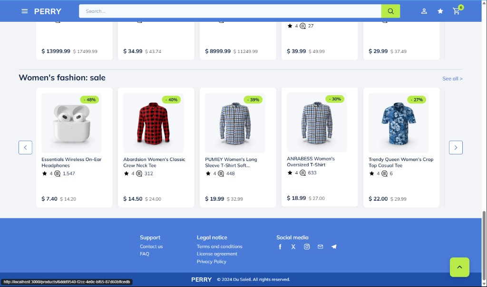

Карусель Sale внизу главной + футер.

### 04 · Home — меню категорий

**Файл:** [`home/04-home-menu-categories.png`](./home/04-home-menu-categories.png)

Боковое меню: аватар, Product catalog, дерево категорий.

### 05 · Home — меню аккаунта

**Файл:** [`home/05-home-menu-account.png`](./home/05-home-menu-account.png)

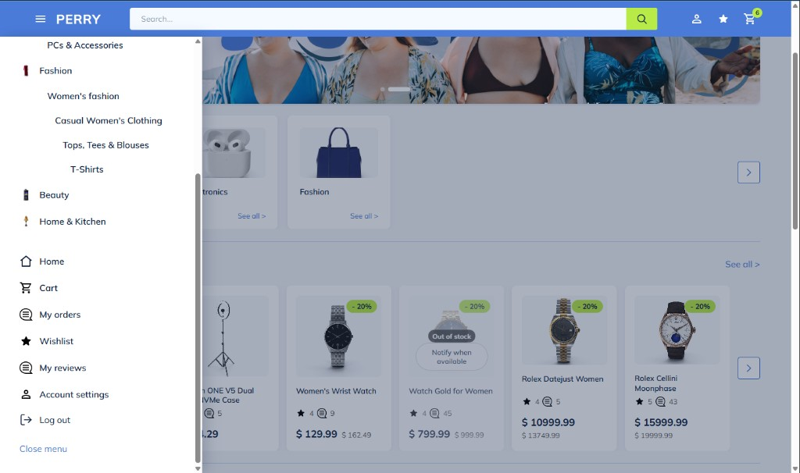

Нижняя часть меню: Home, Cart, My orders, Wishlist, My reviews, Account settings, Log out.

---

## 2. Каталог

### 06 · Catalog — Fashion

**Файл:** [`catalog/06-catalog-fashion.png`](./catalog/06-catalog-fashion.png)  
**URL:** `/catalog` (Fashion)

Сетка товаров, фильтры Brand / Fabric type, сортировка.

---

## 3. Страница товара

### 07 · Product page

**Файл:** [`product/07-product-page.png`](./product/07-product-page.png)  
**URL:** `/products/...`

Nike Air Jordan 1: галерея, цена, Buy now / Add to cart / Wishlist.

### 08 · Product — lightbox фото

**Файл:** [`product/08-product-lightbox.png`](./product/08-product-lightbox.png)

Полноэкранный просмотр фото (1/4), стрелки, закрытие.

### 09 · Product — характеристики + отзывы

**Файл:** [`product/09-product-specs-reviews.png`](./product/09-product-specs-reviews.png)

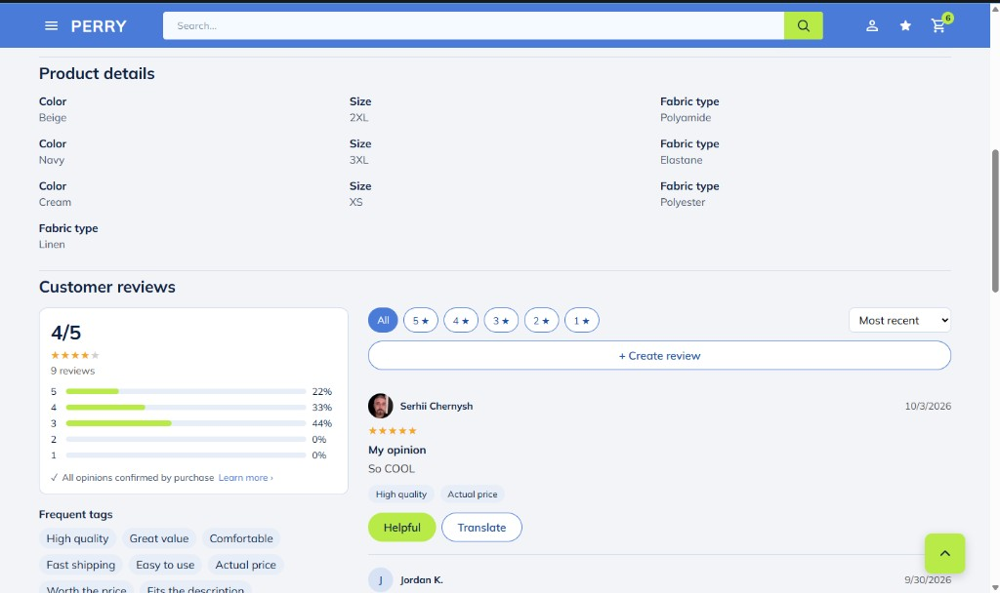

Specs (Color / Size / Fabric) и блок Customer reviews на PDP.

### 10 · Product — Customer reviews

**Файл:** [`product/10-product-reviews.png`](./product/10-product-reviews.png)

Сводка рейтинга, теги, фильтры, Create review, Helpful / Translate.

---

## 4. Корзина и Checkout

### 11 · Shopping cart

**Файл:** [`cart-checkout/11-cart.png`](./cart-checkout/11-cart.png)  
**URL:** `/cart`

Позиции, Qty, Order summary, Proceed to checkout.

### 12 · Checkout — Country

**Файл:** [`cart-checkout/12-checkout-country.png`](./cart-checkout/12-checkout-country.png)  
**URL:** `/checkout`

Country = Ukraine, оплата Card, Place order.

### 13 · Checkout — State

**Файл:** [`cart-checkout/13-checkout-state.png`](./cart-checkout/13-checkout-state.png)

Выбор области Украины (State).

### 14 · Checkout — City

**Файл:** [`cart-checkout/14-checkout-city.png`](./cart-checkout/14-checkout-city.png)

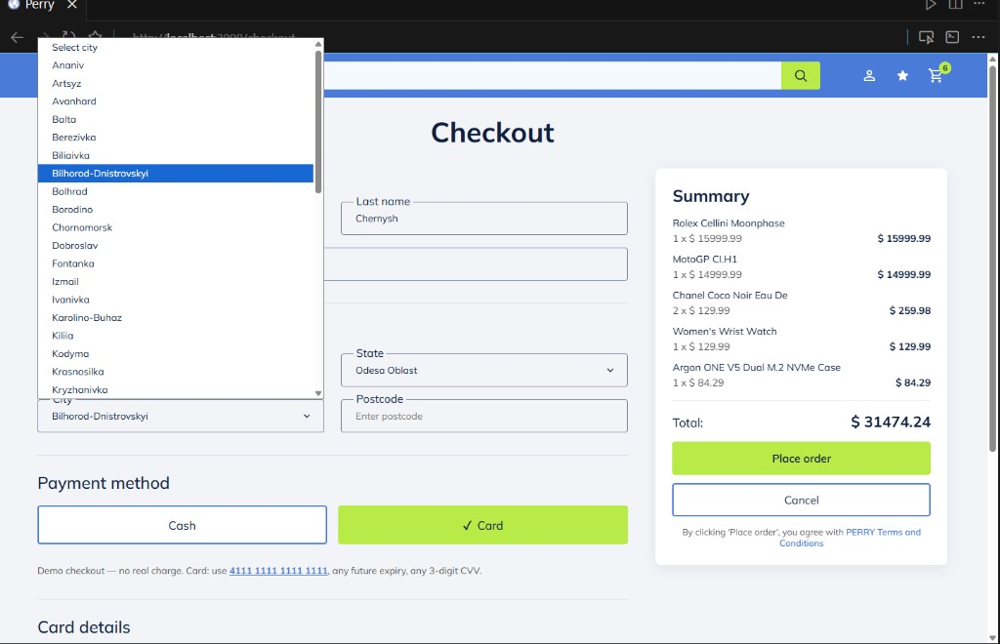

Города при State = Odesa Oblast.

### 15 · Checkout — Card details

**Файл:** [`cart-checkout/15-checkout-card-details.png`](./cart-checkout/15-checkout-card-details.png)

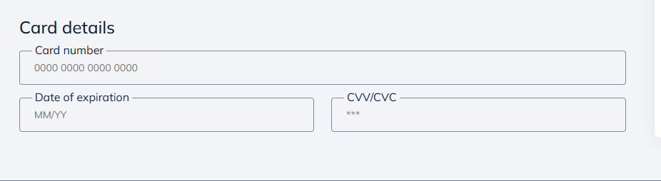

Поля номера карты, срока и CVV.

---

## 5. Личный кабинет

### 16 · Wishlist

**Файл:** [`account/16-account-wishlist.png`](./account/16-account-wishlist.png)  
**URL:** `/account/wishlist`

Избранное + аватар в сайдбаре.

### 17 · My reviews

**Файл:** [`account/17-account-my-reviews.png`](./account/17-account-my-reviews.png)  
**URL:** `/account/reviews`

Отзывы пользователя с тегами.

### 18 · Edit photo

**Файл:** [`account/18-account-edit-photo.png`](./account/18-account-edit-photo.png)

Модалка обрезки аватара.

### 19 · Change name

**Файл:** [`account/19-account-change-name.png`](./account/19-account-change-name.png)

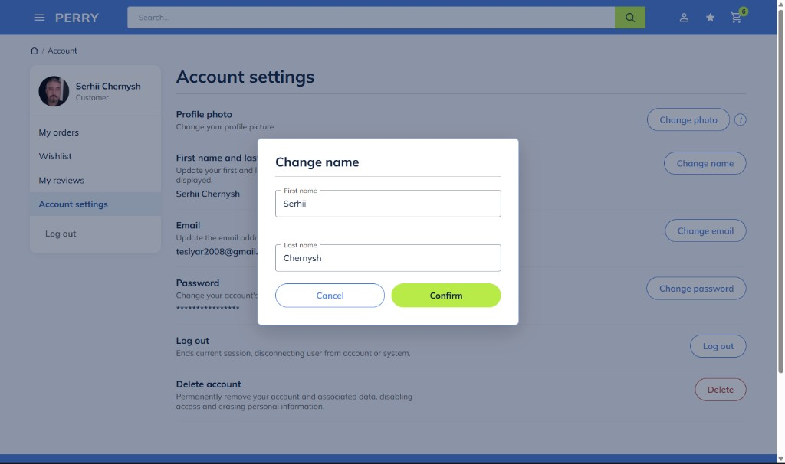

Смена имени / фамилии.

### 20 · Change email

**Файл:** [`account/20-account-change-email.png`](./account/20-account-change-email.png)

Новый email, пароль, код подтверждения.

### 21 · Change password

**Файл:** [`account/21-account-change-password.png`](./account/21-account-change-password.png)

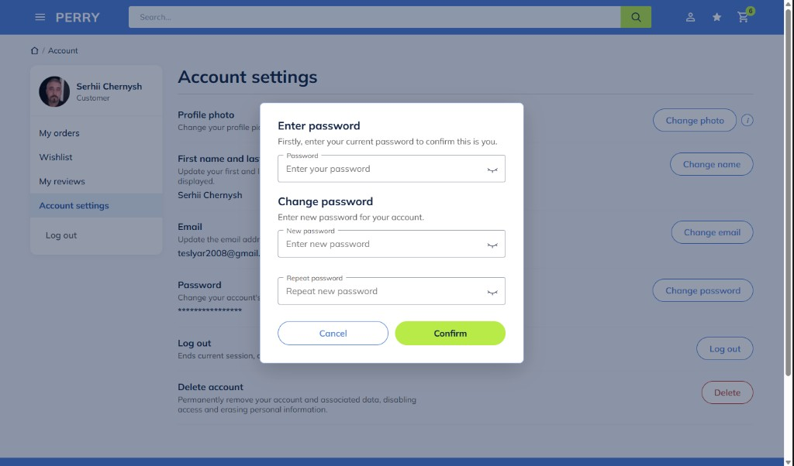

Текущий пароль + новый пароль / повтор.

---

## 6. Auth

### 22 · Login

**Файл:** [`auth/22-auth-login.png`](./auth/22-auth-login.png)

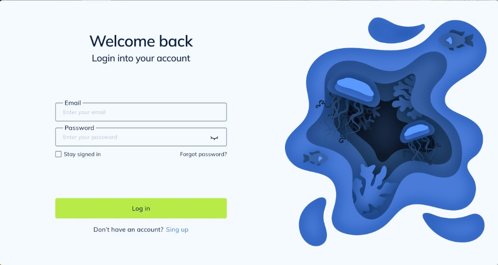

Welcome back — вход в аккаунт.

### 23 · Login — ошибки

**Файл:** [`auth/23-auth-login-errors.png`](./auth/23-auth-login-errors.png)

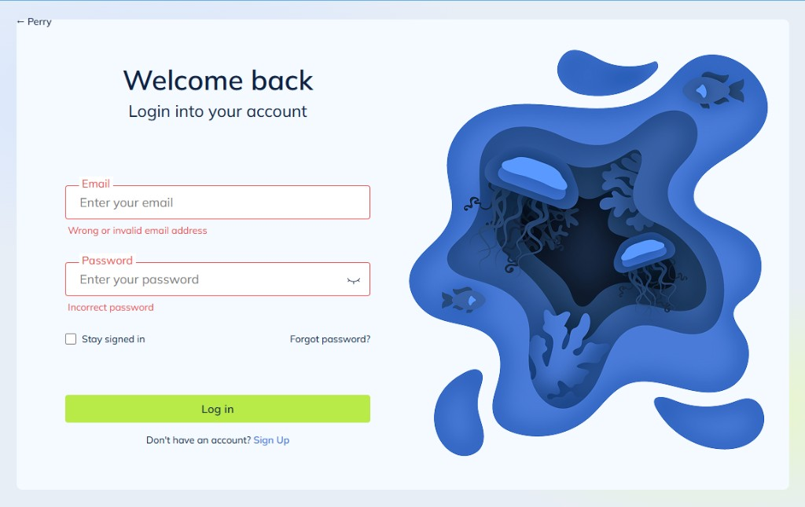

Ошибки валидации на форме входа.

### 24 · Register

**Файл:** [`auth/24-auth-register.png`](./auth/24-auth-register.png)

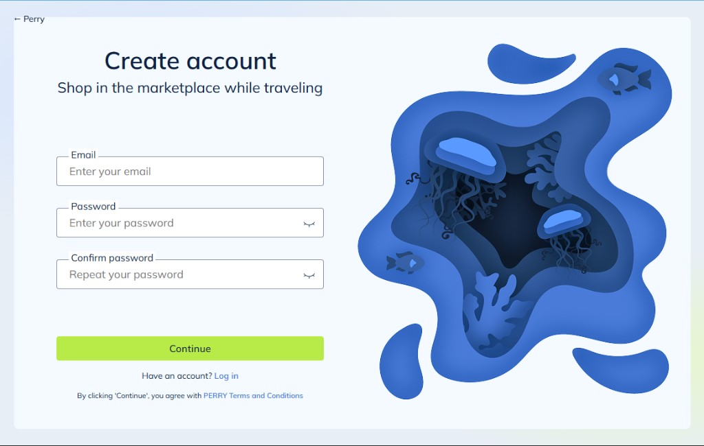

Регистрация нового пользователя.

### 25 · Register — ошибки

**Файл:** [`auth/25-auth-register-errors.png`](./auth/25-auth-register-errors.png)

Ошибки валидации на регистрации.

### 26 · Verify email — пусто

**Файл:** [`auth/26-auth-verify-empty.png`](./auth/26-auth-verify-empty.png)

Экран подтверждения email, поля кода пустые.

### 27 · Verify email — код введён

**Файл:** [`auth/27-auth-verify-filled.png`](./auth/27-auth-verify-filled.png)

Код подтверждения заполнен.

### 28 · Verify email — ошибка

**Файл:** [`auth/28-auth-verify-error.png`](./auth/28-auth-verify-error.png)

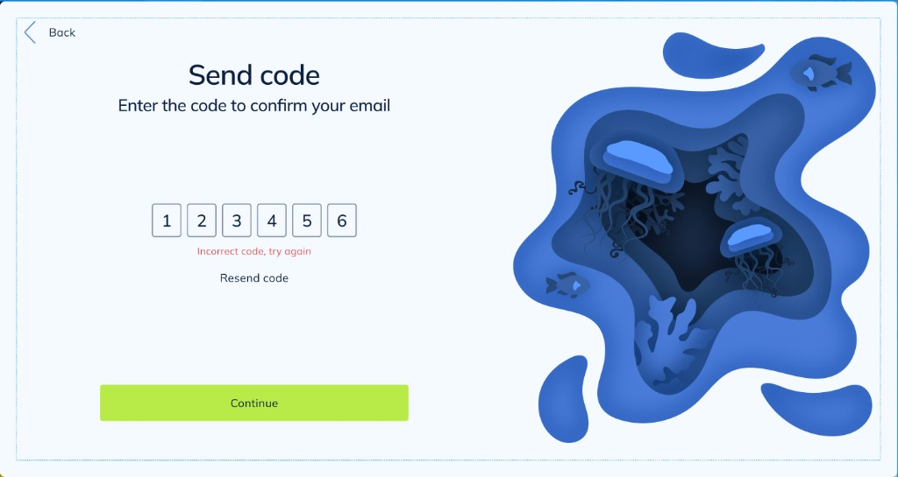

Ошибка неверного кода.

### 29 · Forgot password

**Файл:** [`auth/29-auth-forgot.png`](./auth/29-auth-forgot.png)

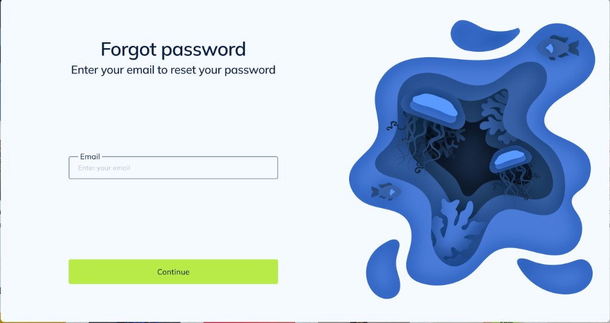

Восстановление пароля.

### 30 · Forgot password — ошибка

**Файл:** [`auth/30-auth-forgot-error.png`](./auth/30-auth-forgot-error.png)

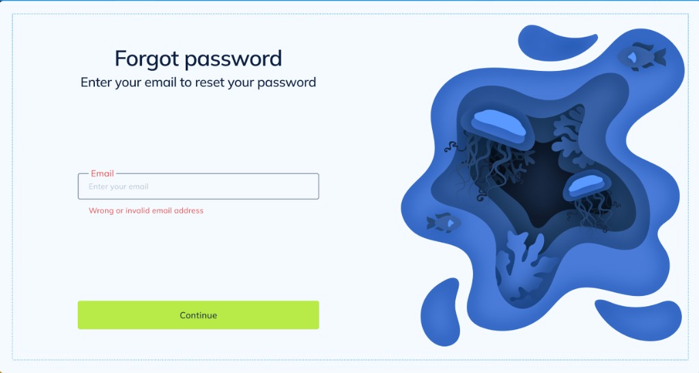

Ошибка на форме восстановления.

---

## 7. Legal

### 31 · Terms and conditions

**Файл:** [`legal/31-terms.png`](./legal/31-terms.png)  
**URL:** `/terms`

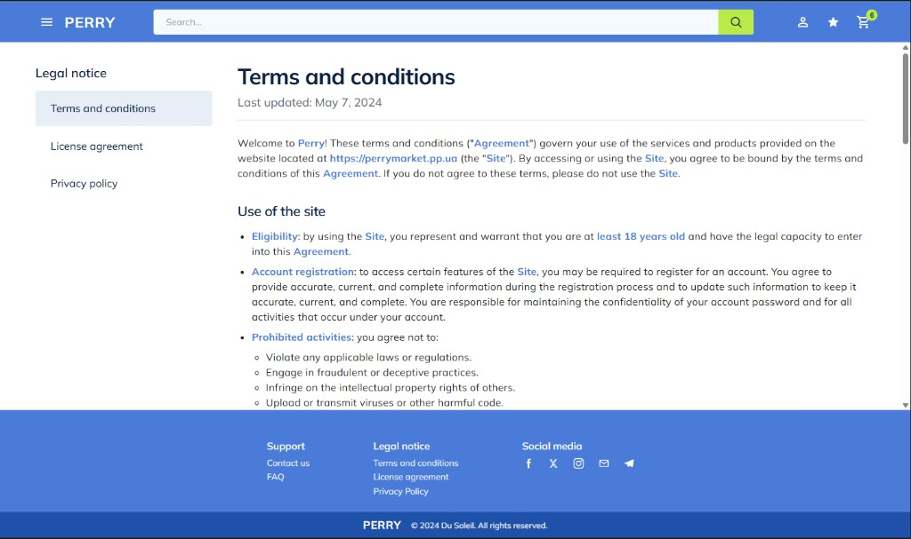

### 32 · License agreement

**Файл:** [`legal/32-license.png`](./legal/32-license.png)  
**URL:** `/license`

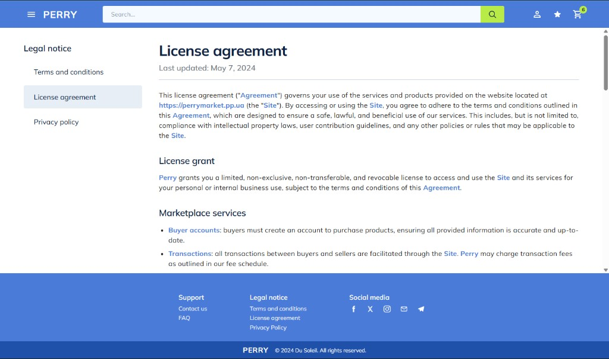

### 33 · Privacy policy

**Файл:** [`legal/33-privacy.png`](./legal/33-privacy.png)  
**URL:** `/privacy`

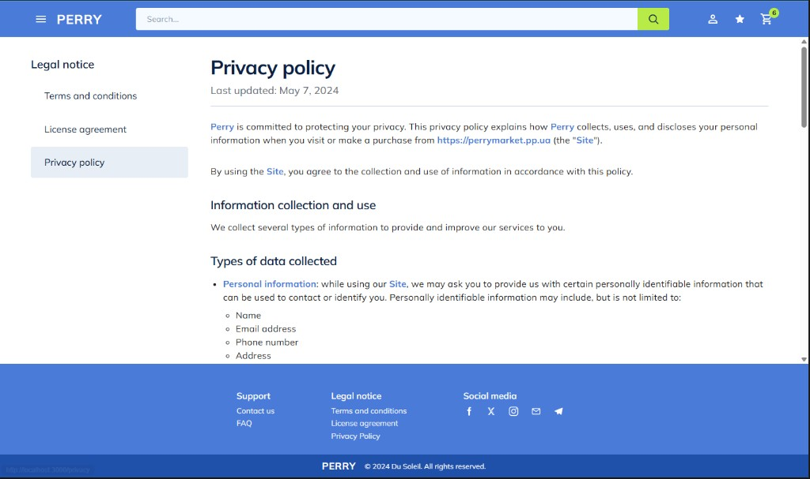

---

## 8. Админка

### 34 · Admin dashboard

**Файл:** [`admin/34-admin-dashboard.png`](./admin/34-admin-dashboard.png)  
**URL:** `/admin`

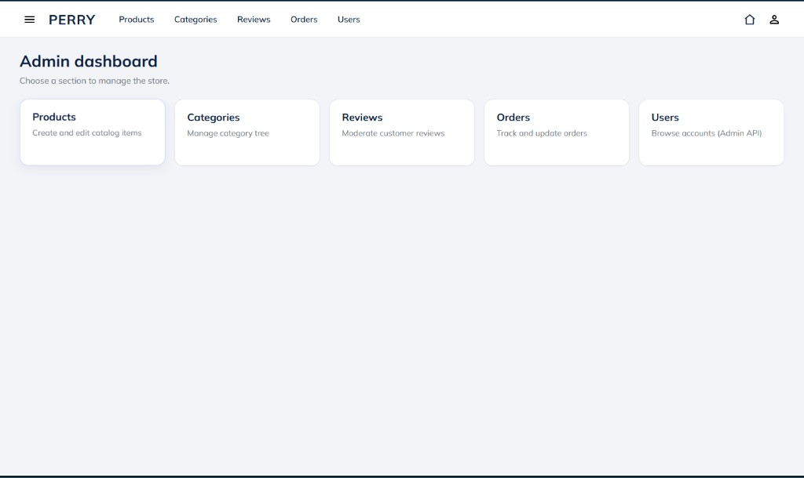

Главный экран: Products / Categories / Reviews / Orders / Users.

### 35 · Products

**Файл:** [`admin/35-admin-products.png`](./admin/35-admin-products.png)

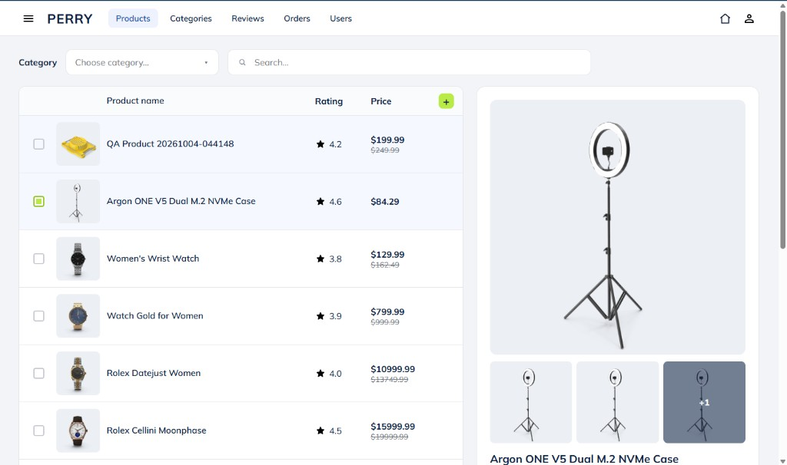

Список товаров + detail с галереей.

### 36 · Create product

**Файл:** [`admin/36-admin-create-product.png`](./admin/36-admin-create-product.png)

Форма создания: General information.

### 37 · Categories

**Файл:** [`admin/37-admin-categories.png`](./admin/37-admin-categories.png)

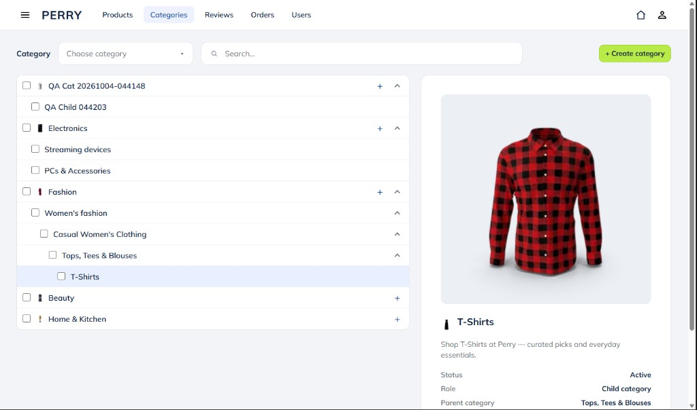

Дерево категорий + detail.

### 38 · Edit subcategory

**Файл:** [`admin/38-admin-categories-edit.png`](./admin/38-admin-categories-edit.png)

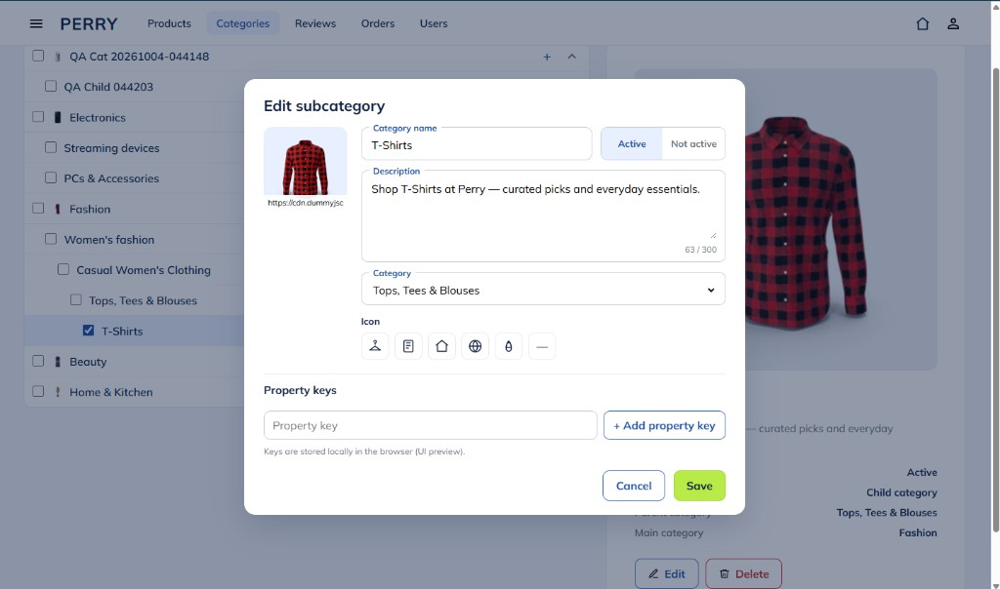

Модалка редактирования подкатегории.

### 39 · Reviews

**Файл:** [`admin/39-admin-reviews.png`](./admin/39-admin-reviews.png)

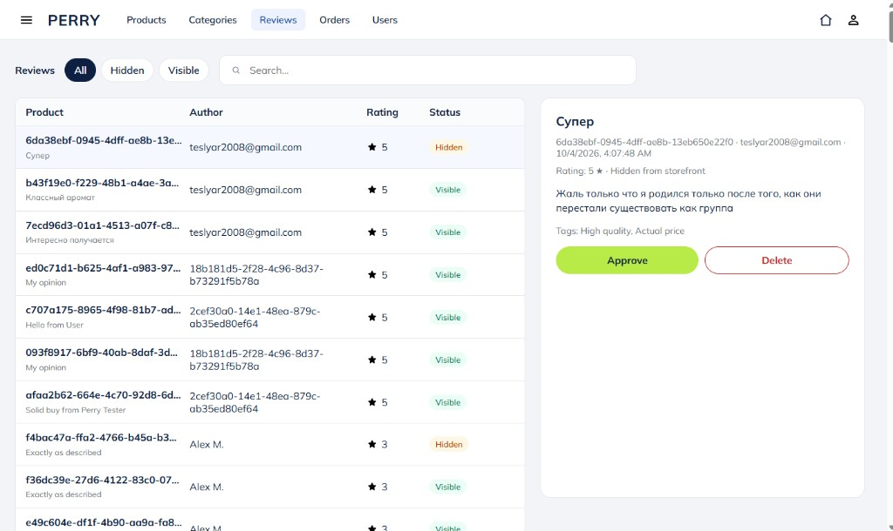

Модерация: Approve / Delete, Hidden / Visible.

### 40 · Orders

**Файл:** [`admin/40-admin-orders.png`](./admin/40-admin-orders.png)

Фильтры, даты, statusCounts.

### 41 · Users

**Файл:** [`admin/41-admin-users.png`](./admin/41-admin-users.png)

Роли и статусы Active / Deleted.

### 42 · Users — Columns

**Файл:** [`admin/42-admin-users-columns.png`](./admin/42-admin-users-columns.png)

Настройка видимых колонок таблицы.

### 43 · Users — empty

**Файл:** [`admin/43-admin-users-empty.png`](./admin/43-admin-users-empty.png)

Empty state «No users in the selected role».
