# Скриншоты Perry

Актуальные кадры витрины / auth / legal и **личного кабинета (Account, 14 шт.)**.

Картинки товаров в seed — placeholder (picsum) для демо бэкенда.

---

## 3. Вход покупателя

**Файл:** [`03-login.png`](./03-login.png)  
**URL:** `/Account/Login`

UI «Welcome back»: Email / Password, Stay signed in, Log in.

---

## 12. Welcome back (вход)

**Файл:** [`12-auth-login.png`](./12-auth-login.png)  
**URL:** `/Account/Login`

Экран входа покупателя (Email / Password).

---

## 13. Welcome back — ошибки валидации

**Файл:** [`13-auth-login-errors.png`](./13-auth-login-errors.png)

Пустые поля: сообщения валидации.

---

## 14. Create account (регистрация)

**Файл:** [`14-auth-register.png`](./14-auth-register.png)  
**URL:** `/Account/Register`

Регистрация: Email + Password + Confirm.

---

## 15. Create account — ошибки валидации

**Файл:** [`15-auth-register-errors.png`](./15-auth-register-errors.png)

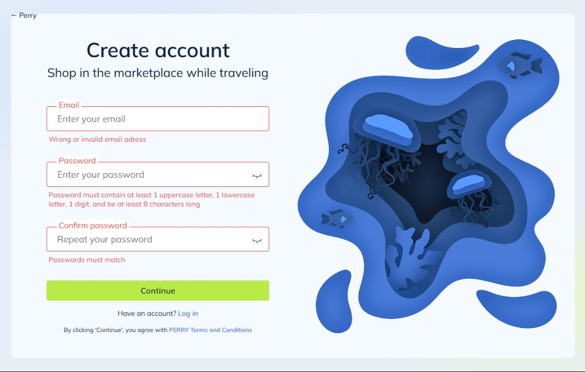

Неверный email / слабый пароль / mismatch.

---

## 16. Send code — пустые поля

**Файл:** [`16-auth-verify-empty.png`](./16-auth-verify-empty.png)  
**URL:** `/Account/VerifyCode`

6 полей кода после 3 неудачных Login.

---

## 17. Send code — код введён, таймер Resend

**Файл:** [`17-auth-verify-filled.png`](./17-auth-verify-filled.png)

Код введён, Resend 0:59.

---

## 18. Send code — неверный код

**Файл:** [`18-auth-verify-error.png`](./18-auth-verify-error.png)

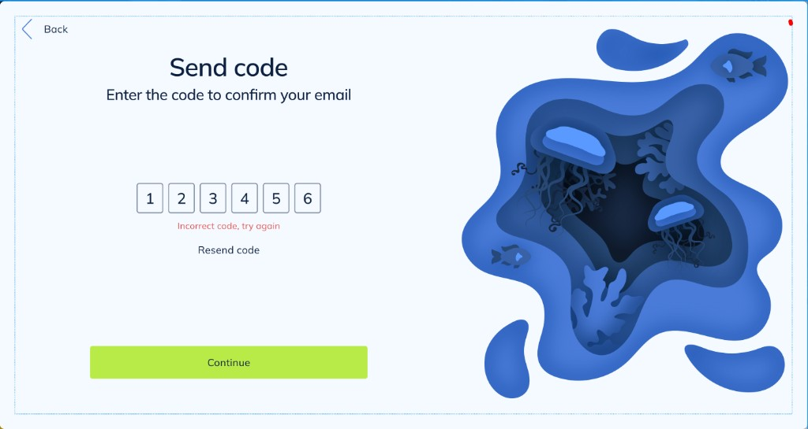

Incorrect code, try again.

---

## 19. Forgot password

**Файл:** [`19-auth-forgot.png`](./19-auth-forgot.png)  
**URL:** `/Account/ForgotPassword`

Ввод email для сброса пароля.

---

## 20. Forgot password — ошибка

**Файл:** [`20-auth-forgot-error.png`](./20-auth-forgot-error.png)

Wrong or invalid email address.

---

## 21. Reset password

**Файл:** [`21-auth-reset.png`](./21-auth-reset.png)  
**URL:** `/Account/ResetPassword`

New password + Repeat password.

---

## 22. Reset password — ошибки

**Файл:** [`22-auth-reset-error.png`](./22-auth-reset-error.png)

Necessary to continue / Passwords must match.

---

## 23. Finishing touches

**Файл:** [`23-auth-finishing.png`](./23-auth-finishing.png)

First name + Last name после Register.

---

## 24. Finishing touches — ошибки

**Файл:** [`24-auth-finishing-error.png`](./24-auth-finishing-error.png)

First/Last name is required.

---

## 25. Congratulations!

**Файл:** [`25-auth-success.png`](./25-auth-success.png)

Успех регистрации или сброса пароля.

---

## 26. Главная (витрина 2026-09)

**Файл:** [`26-home-storefront.png`](./26-home-storefront.png)  
**URL:** `/`

Hero Sale, категории, Trending deals.

---

## 27. Product Page (верх)

**Файл:** [`27-product-page.png`](./27-product-page.png)

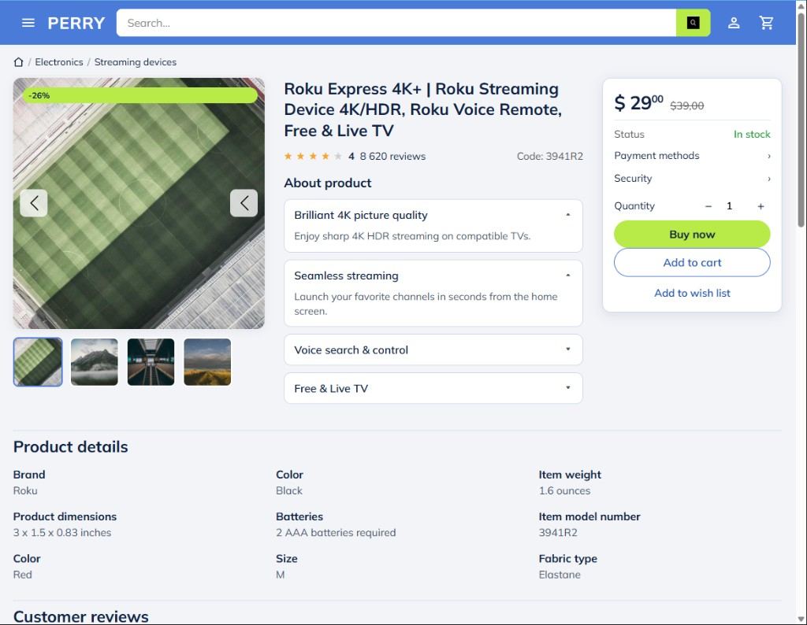

Галерея, About, buy-box, Product details.

---

## 28. Product List (фильтры)

**Файл:** [`28-catalog-filters.png`](./28-catalog-filters.png)

Material / Size / Color, grid.

---

## 29. Customer reviews

**Файл:** [`29-product-reviews.png`](./29-product-reviews.png)

Сводка, tags, Helpful / Translate.

---

## 30. License agreement

**Файл:** [`30-license.png`](./30-license.png)  
**URL:** `/License`

Legal notice + License agreement.

---

## 31. Privacy policy

**Файл:** [`31-privacy.png`](./31-privacy.png)  
**URL:** `/Privacy`

Privacy policy.

---

## 32. Product Page (related + footer)

**Файл:** [`32-product-related-footer.png`](./32-product-related-footer.png)

Fashion: sale и подвал.

---

## 33. Terms and conditions

**Файл:** [`33-terms.png`](./33-terms.png)  
**URL:** `/Terms`

Terms and conditions.

---

# Account — личный кабинет (14 новых)

Экраны Wishlist / My orders / Account settings.  
Путь: [`docs/screenshots/account/`](./account/)

---

## A01. Wishlist

**Файл:** [`account/01-wishlist.png`](./account/01-wishlist.png)  
**URL:** `/account/wishlist`

Сайдбар аккаунта, сетка избранного, кнопка **Remove**, поиск по wishlist.

---

## A02. Wishlist — подтверждение удаления

**Файл:** [`account/02-wishlist-remove-modal.png`](./account/02-wishlist-remove-modal.png)

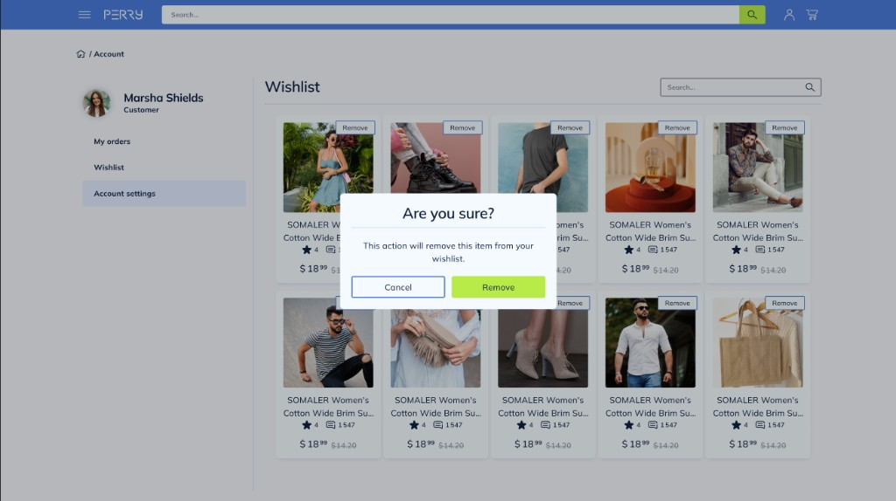

Модалка **Are you sure?** → Cancel / Remove.

---

## A03. My orders

**Файл:** [`account/03-my-orders.png`](./account/03-my-orders.png)  
**URL:** `/account/orders`

Список заказов со статусами (Received / Ready for pickup / Shipped / Ordered / Cancelled), кнопка **Details**.

---

## A04. Account settings — tip к фото

**Файл:** [`account/04-account-settings-photo-tip.png`](./account/04-account-settings-photo-tip.png)  
**URL:** `/account/settings`

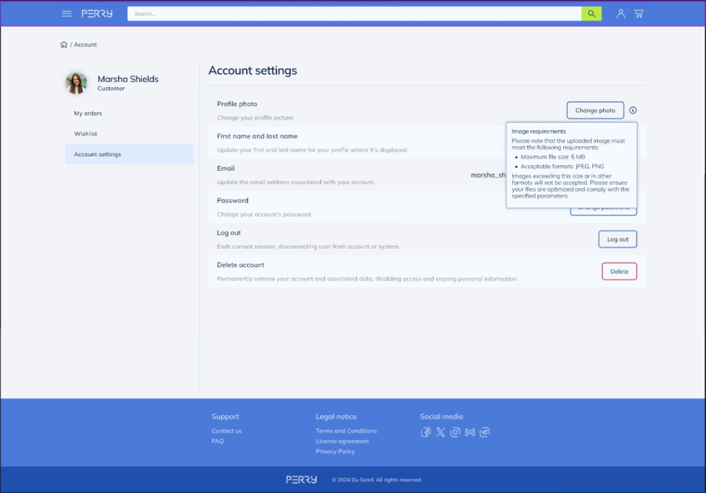

Подсказка требований к фото: JPEG / PNG, max 5 MB.

---

## A05. Order details (Ordered)

**Файл:** [`account/05-order-details-modal.png`](./account/05-order-details-modal.png)

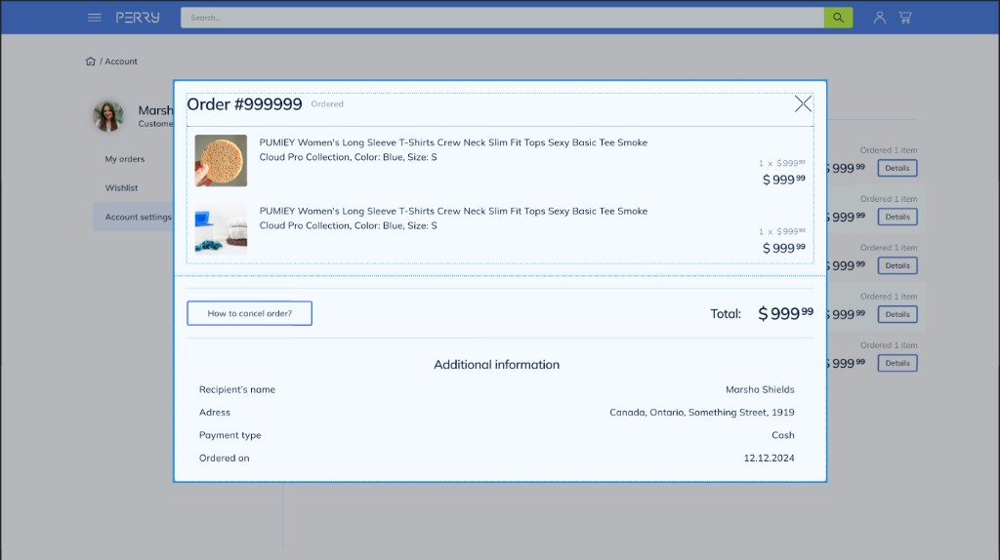

Модалка деталей заказа: позиции, Total, Additional information, How to cancel order?

---

## A06. Order details (Received)

**Файл:** [`account/06-order-details-received.png`](./account/06-order-details-received.png)

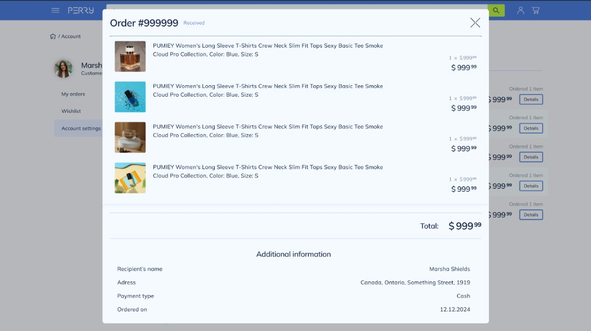

Тот же модал со статусом **Received**.

---

## A07. Account settings

**Файл:** [`account/07-account-settings.png`](./account/07-account-settings.png)  
**URL:** `/account/settings`

Строки: Profile photo, Name, Email, Password, Log out, Delete account.

---

## A08. Change name

**Файл:** [`account/08-change-name-modal.png`](./account/08-change-name-modal.png)

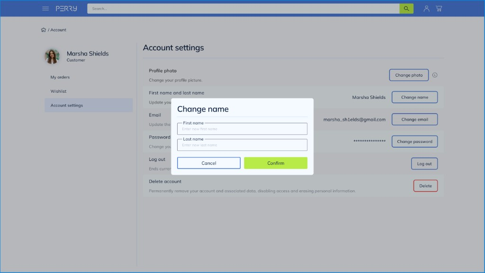

First name / Last name, Cancel / Confirm.

---

## A09. Change password

**Файл:** [`account/09-change-password-modal.png`](./account/09-change-password-modal.png)

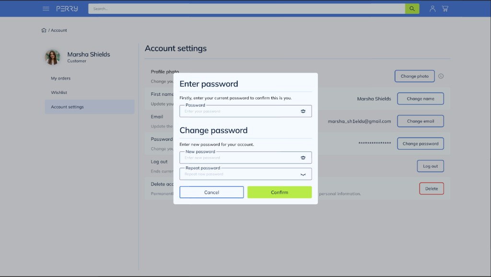

Текущий пароль + новый + повтор, иконки показать/скрыть.

---

## A10. Change password — валидация

**Файл:** [`account/10-change-password-validation.png`](./account/10-change-password-validation.png)

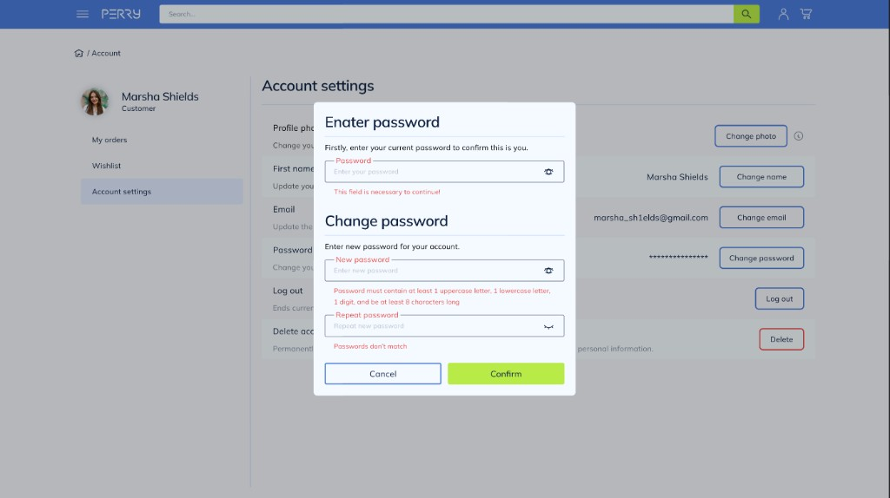

Ошибки: обязательное поле, сложность пароля (8+ / upper / lower / digit), несовпадение.

---

## A11. Change email

**Файл:** [`account/11-change-email-modal.png`](./account/11-change-email-modal.png)

Новый email, пароль, 6-значный код, **Send code**, Cancel / Confirm.

---

## A12. Change email — валидация

**Файл:** [`account/12-change-email-validation.png`](./account/12-change-email-validation.png)

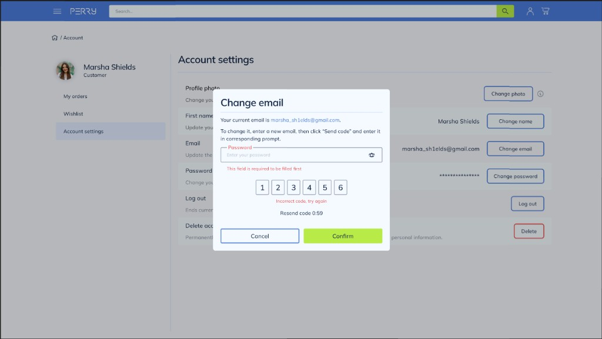

Ошибки пароля/кода, таймер **Resend code**.

---

## A13. Log out?

**Файл:** [`account/13-logout-confirm.png`](./account/13-logout-confirm.png)

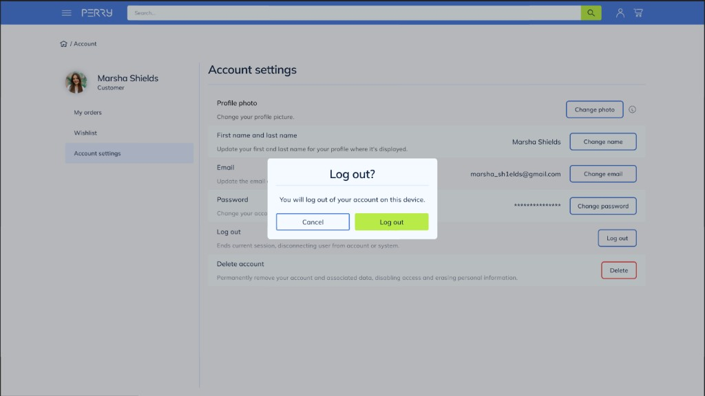

Подтверждение выхода с устройства.

---

## A14. Delete account?

**Файл:** [`account/14-delete-account-confirm.png`](./account/14-delete-account-confirm.png)

Предупреждение о безвозвратном удалении; Cancel (зелёный) / Delete account (красный outline).
