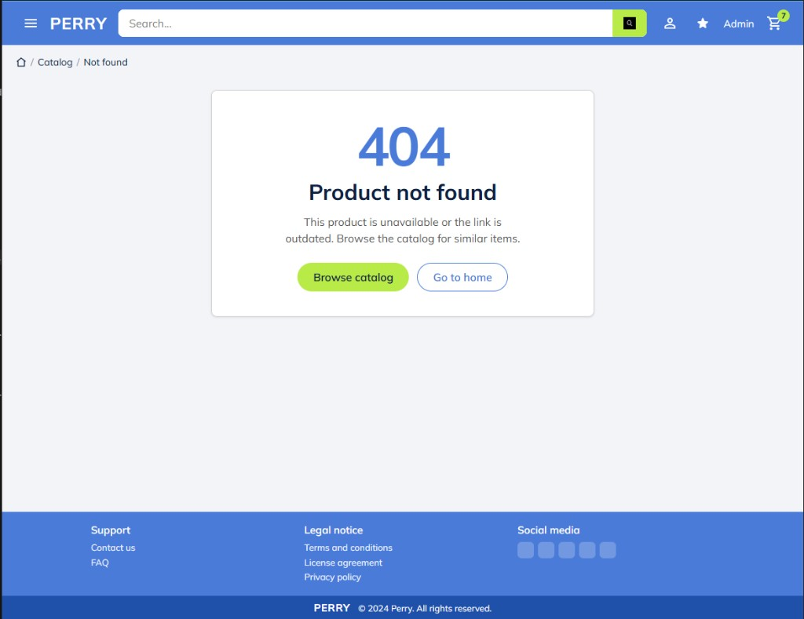
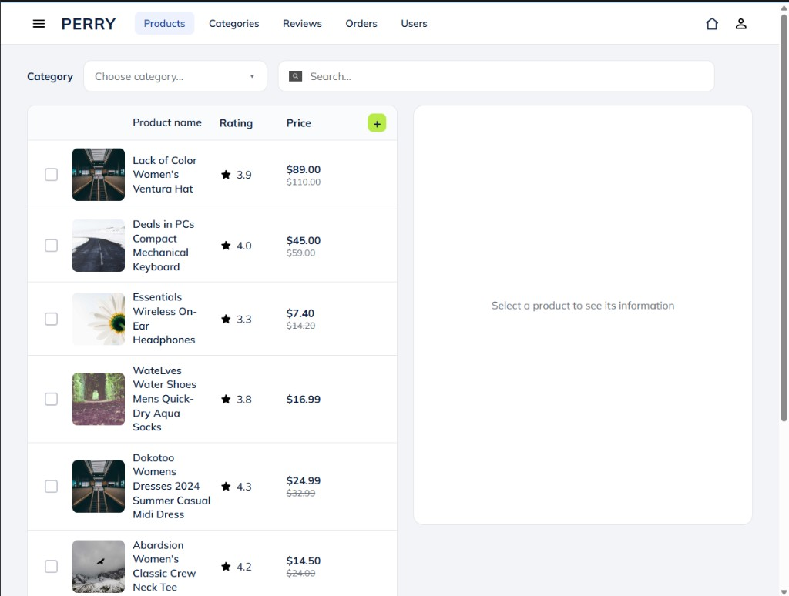
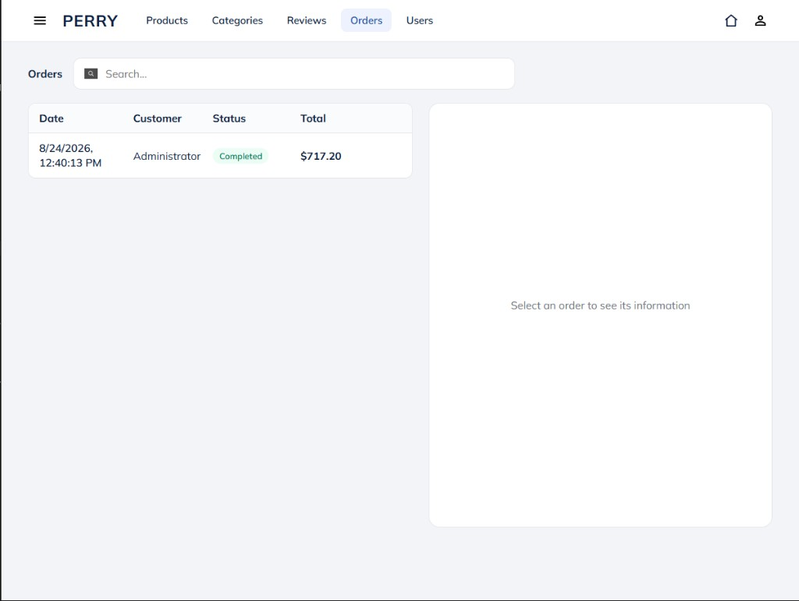
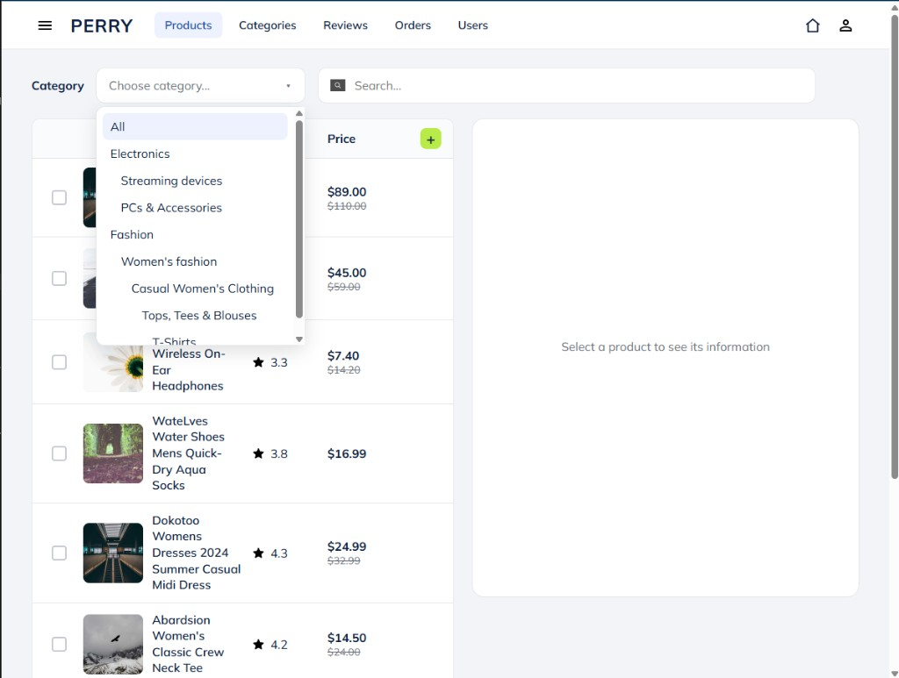
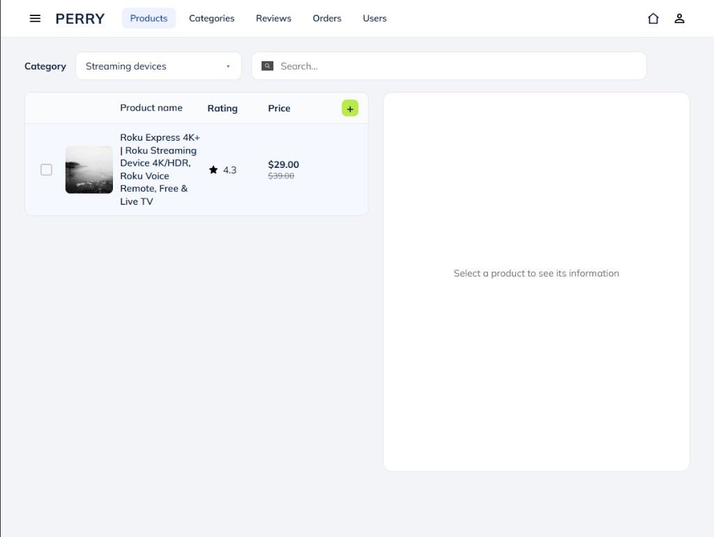
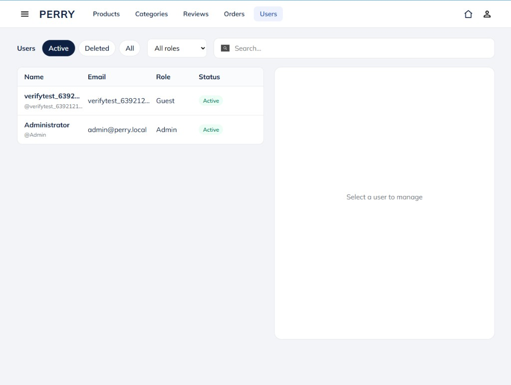
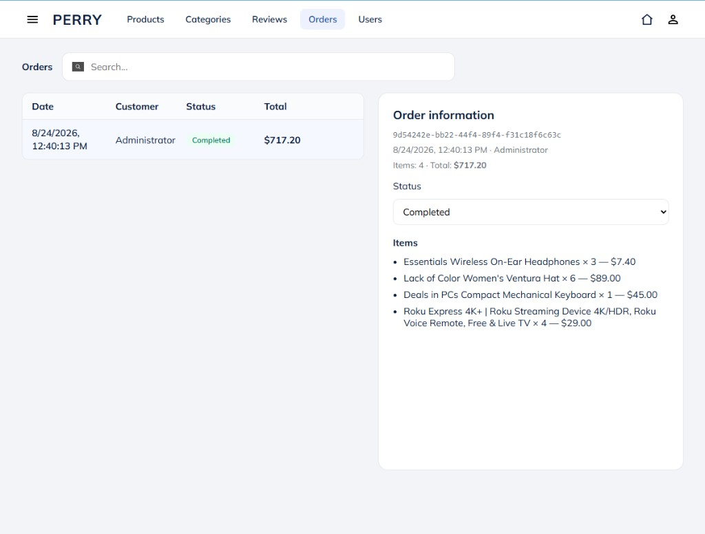
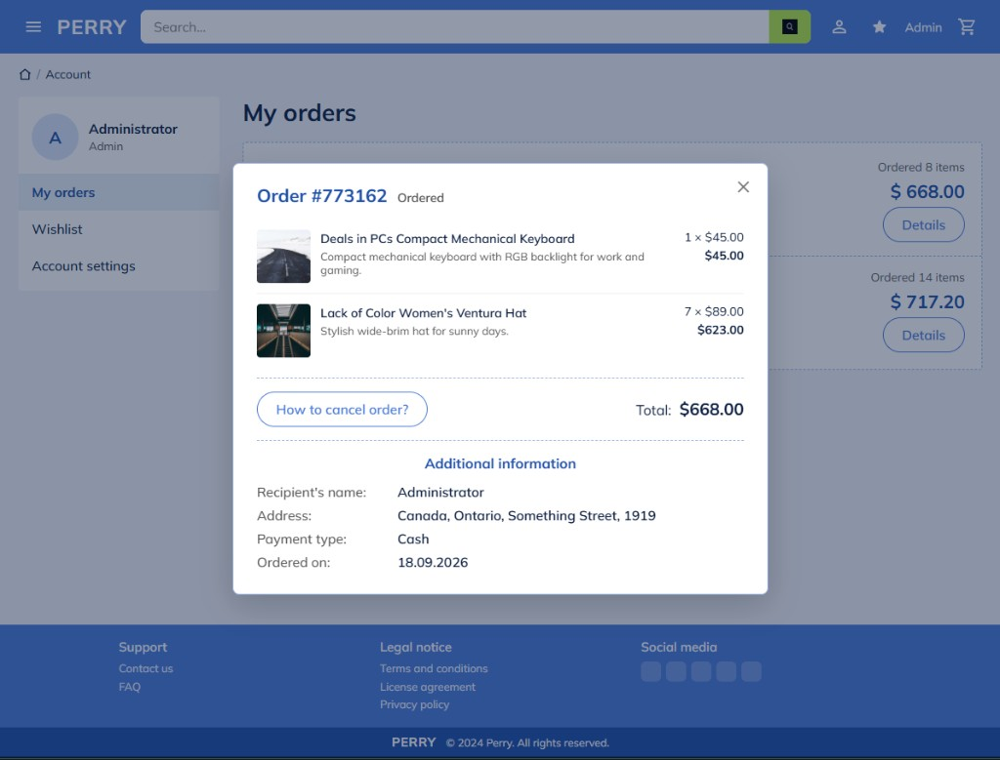
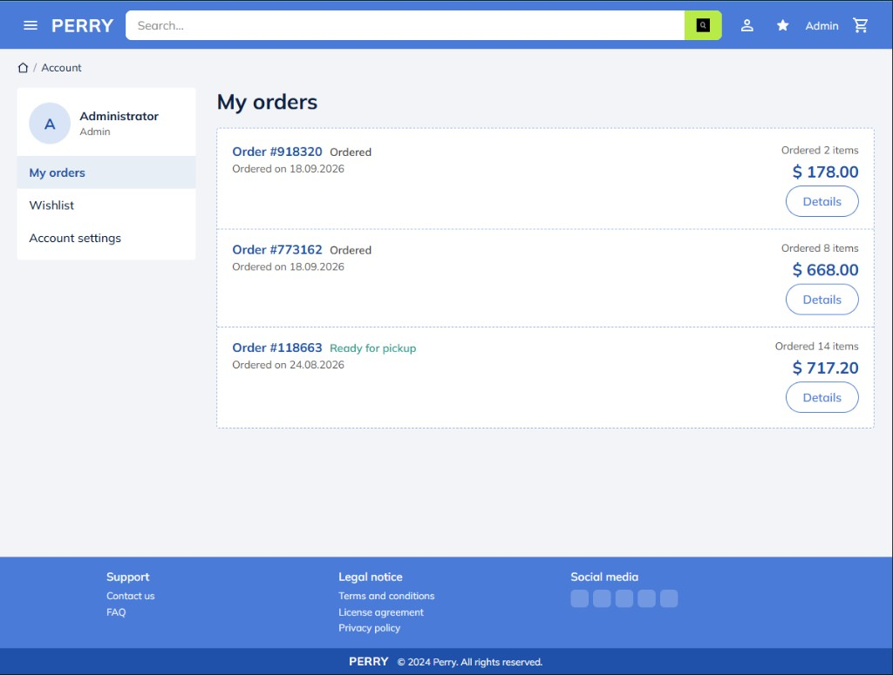
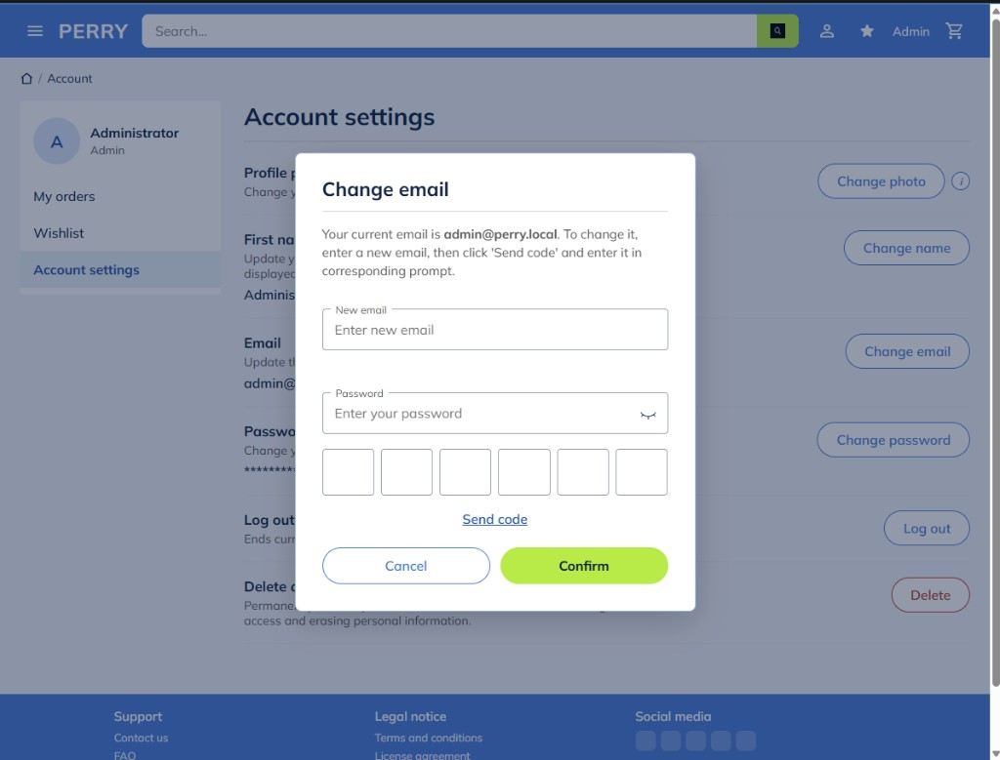

# Скриншоты спринта 19.09.2026

Кадры React-витрины и React-админки после работ 19.09.2026.  
Обзор изменений: [ИЗМЕНЕНИЯ-2026-09-19.md](../../ИЗМЕНЕНИЯ-2026-09-19.md).

Базовый URL: `http://localhost:3000`

---

## S01. 404 Product not found

**Файл:** [`01-404-product-not-found.png`](./01-404-product-not-found.png)  
**URL:** `/products/{missing-id}`

Экран «товар не найден» в стиле витрины: breadcrumbs Catalog / Not found, кнопки Browse catalog / Go to home. Карточка #83.

---

## S02. Admin — Products

**Файл:** [`02-admin-products.png`](./02-admin-products.png)  
**URL:** `/admin/products`

Список товаров (thumbnail, name, rating, price), фильтр Category + Search, правая панель «Select a product…». Карточка #66.

---

## S03. Admin — Categories

**Файл:** [`03-admin-categories.png`](./03-admin-categories.png)  
**URL:** `/admin/categories`

Корневые категории (Electronics, Fashion), Active yes/no, кнопка «+», панель информации. Карточка #65.

---

## S04. Admin — Reviews (список)

**Файл:** [`04-admin-reviews.png`](./04-admin-reviews.png)  
**URL:** `/admin/reviews`

Модерация: фильтры All / Hidden / Visible, таблица Product / Author / Rating / Status. Карточка #69.

---

## S05. Admin — Orders (список)

**Файл:** [`05-admin-orders.png`](./05-admin-orders.png)  
**URL:** `/admin/orders`

Список заказов (Date, Customer, Status, Total); правая панель пустая до выбора строки.

---

## S07. Admin — Products: dropdown категорий

**Файл:** [`07-admin-products-category-dropdown.png`](./07-admin-products-category-dropdown.png)  
**URL:** `/admin/products`

Иерархический выбор Category (All / Electronics / Fashion / …) в тулбаре.

---

## S08. Admin — Products: фильтр Streaming devices

**Файл:** [`08-admin-products-filter-streaming.png`](./08-admin-products-filter-streaming.png)  
**URL:** `/admin/products?categoryId=…`

Отфильтрованный список (пример: Roku Express 4K+) после выбора подкатегории.

---

## S09. Admin — Users (фильтры Active)

**Файл:** [`09-admin-users-filters.png`](./09-admin-users-filters.png)  
**URL:** `/admin/users`

Активные пользователи (Guest / Admin); длинные имена/email обрезаются с ellipsis.

---

## S10. Admin — Orders: детали

**Файл:** [`10-admin-orders-details.png`](./10-admin-orders-details.png)  
**URL:** `/admin/orders?selectedId=…`

Выбранный заказ: ID, состав, Total, смена Status (Completed).

---

## S11. Admin — Reviews: Hide

**Файл:** [`11-admin-reviews-moderate-hide.png`](./11-admin-reviews-moderate-hide.png)  
**URL:** `/admin/reviews`

Панель модерации видимого отзыва: текст, теги, кнопки **Hide** / **Delete** (API `PUT …/reject`).

---

## S12. Account — My orders

**Файл:** [`12-account-my-orders.png`](./12-account-my-orders.png)  
**URL:** `/account/orders`

Кабинет: список заказов со статусами (Ordered / Ready for pickup), кнопка Details.

---

## S13. Admin — Reviews: Approve (скрытый)

**Файл:** [`13-admin-reviews-approve.png`](./13-admin-reviews-approve.png)  
**URL:** `/admin/reviews`

Скрытый с витрины отзыв: **Approve** / **Delete** (`PUT …/approve`).

---

## S14. Account — Order details (модалка)

**Файл:** [`14-account-order-details-modal.png`](./14-account-order-details-modal.png)  
**URL:** `/account/orders` → Details

Модалка заказа: позиции, Total, Additional information, How to cancel order?

---

## S15. Account — Order details (второй заказ)

**Файл:** [`15-account-order-details-modal-2.png`](./15-account-order-details-modal-2.png)

Другой заказ (пример #918320): 2× hat, Total $178.00.

---

## S16. Account — Change email

**Файл:** [`17-account-change-email-modal.png`](./17-account-change-email-modal.png)  
**URL:** `/account/settings` → Change email

Модалка смены email: New email, Password, 6-digit code, Send code, Cancel / Confirm.
