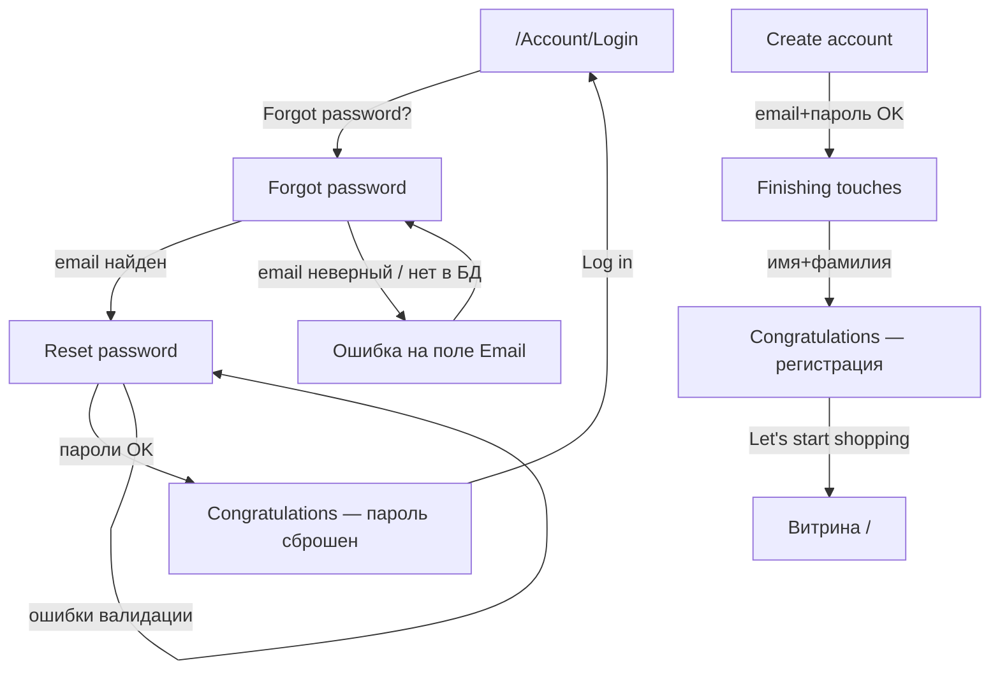
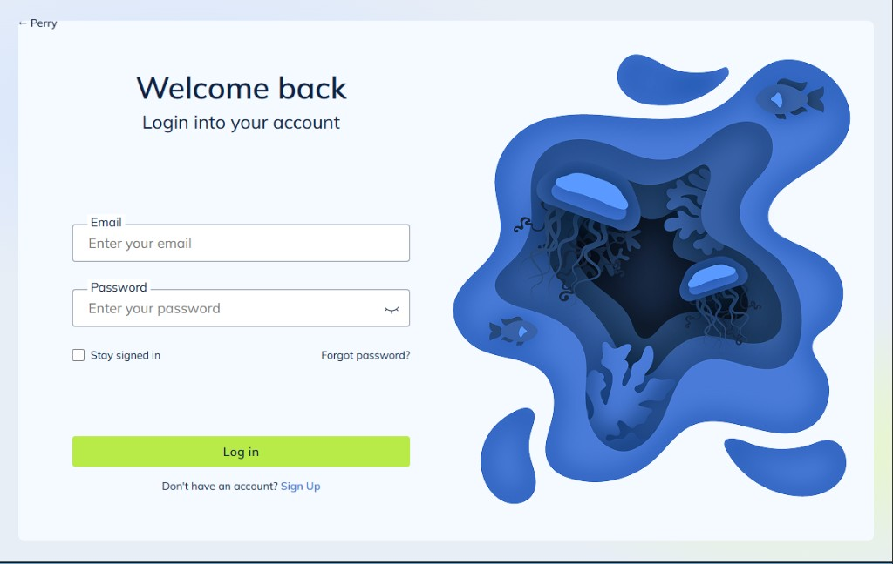
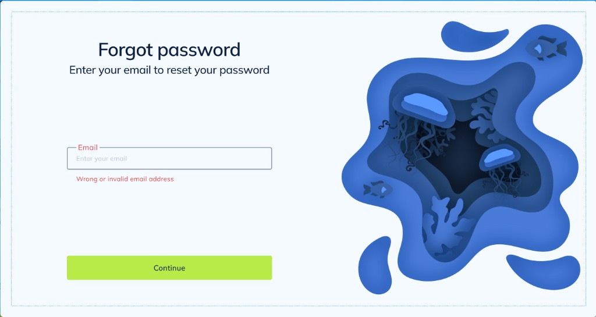
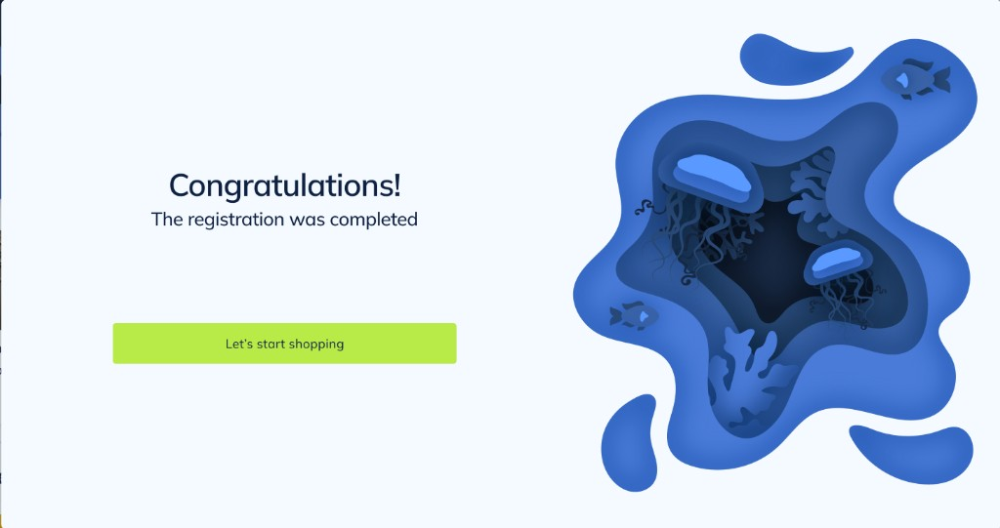
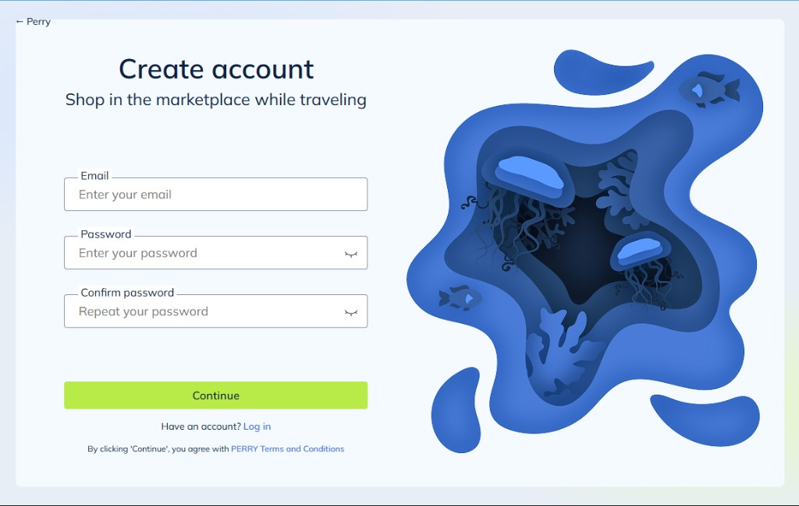
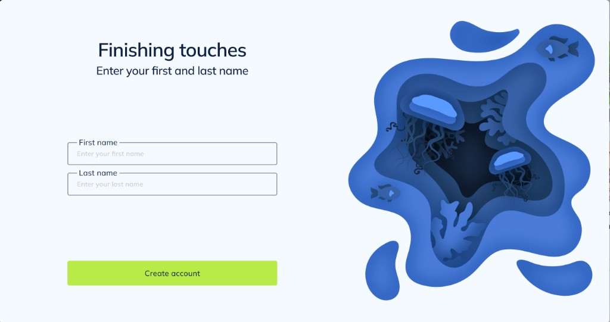

# Восстановление пароля и связанные экраны auth

Пользовательский сценарий: **что появляется, когда**, и **что делать** в каждом случае.  
Ниже — макеты окон (как в perry-front) рядом с описанием шагов.

Связанные страницы (Razor, layout `_AuthLayout`):
- `/Account/ForgotPassword` — Forgot password  
- `/Account/ResetPassword` — Reset password  
- `/Account/AuthSuccess` — Congratulations!  
- `/Account/FinishingTouches` — Finishing touches (после регистрации)  
- также рядом: `/Account/Login`, `/Account/Register`, `/Account/VerifyCode`

Код: `Pages/Account/ForgotPassword*`, `ResetPassword*`, `FinishingTouches*`, `AuthSuccess*`;  
сервис токена: `IPasswordResetService` / `PasswordResetService`.

Макеты в репозитории: [`screenshots/19`–`25-auth-*.png`](./screenshots/).

---

## 1. Карта сценариев (кратко)

---

## 2. Восстановление пароля (основной сервис)

### Когда пользователю это нужно

Забыл пароль на экране входа и не может войти.

### Шаг 0. Вход

| Что видит | Действие |
|-----------|----------|
| `/Account/Login` — Welcome back | Нажать ссылку **Forgot password?** |

*На экране входа нажать **Forgot password?** (справа под полями).*

---

### Шаг 1. Forgot password — ввод email

**URL:** `/Account/ForgotPassword`  
**Заголовок:** Forgot password  
**Подзаголовок:** Enter your email to reset your password  

#### Нормальный вид окна

| Элемент | Назначение | Действие пользователя |
|---------|------------|------------------------|
| Поле **Email** | Email аккаунта | Ввести адрес |
| Кнопка **Continue** | Запрос на сброс | Нажать после ввода |
| **← Back** (в приложении) | На Login | Если передумал |
| Иллюстрация справа | Декор Perry | — |

#### Успешный путь

1. Ввести **существующий** email (есть в БД, аккаунт не удалён).  
2. Нажать **Continue**.  
3. Сервер создаёт одноразовый **токен** (TTL **30 минут**).  
4. Письмо со ссылкой через `IEmailSender` (часто **stub** — в лог).  
5. Открывается окно **Reset password** (`/Account/ResetPassword?token=...`).

#### Ошибка — неверный / неизвестный email

| Ситуация | Что видит | Что сделать |
|----------|-----------|-------------|
| Пустой email / плохой формат | Красный лейбл Email + **Wrong or invalid email address** | Исправить email → снова **Continue** |
| Email не зарегистрирован | То же | Проверить адрес или зарегистрироваться (**Sign Up**) |
| Валидация JS до отправки | То же под полем | Исправить формат |

---

### Шаг 2. Reset password — новый пароль

**URL:** `/Account/ResetPassword?token=...`  
**Заголовок:** Reset password  
**Подзаголовок:** Set a new password for your account  

Токен обязателен. Нет / истёк / уже использован → снова Forgot password.

#### Нормальный вид окна

| Элемент | Действие пользователя |
|---------|------------------------|
| **New password** | Придумать новый пароль (глаз — показать/скрыть) |
| **Repeat password** | Повторить тот же пароль |
| **Continue** | Сохранить |

**Правила пароля:** ≥ 8 символов, 1 заглавная, 1 строчная, 1 цифра.

#### Успешный путь

1. Заполнить оба поля валидным совпадающим паролем.  
2. **Continue** → пароль обновляется, токен сжигается.  
3. Открывается **Congratulations!** (сброс пароля).  
4. **Log in** → войти **новым** паролем.

#### Ошибки валидации

| Ситуация | Что видит на экране | Что сделать |
|----------|---------------------|-------------|
| Пустой New password | **This field is necessary to continue!** | Заполнить New password |
| Пароли не совпадают / пустой Repeat | **Passwords must match** | Ввести одинаковый пароль в оба поля |
| Слабый пароль | Текст про 8 символов / upper / lower / digit | Усилить пароль |
| Просроченный token | Сразу Forgot password | Снова ввести email |

---

### Шаг 3. Congratulations после сброса

**URL:** `/Account/AuthSuccess?kind=reset`  

Макет успеха (в приложении для сброса подзаголовок: *Your password has been reset*, кнопка **Log in**):

| Что видит | Что сделать |
|-----------|-------------|
| **Congratulations!** | — |
| Текст об успешном завершении | — |
| Кнопка действия (**Log in** при сбросе) | Войти новым паролем на `/Account/Login` |

Старый пароль больше не работает.

---

## 3. Регистрация: Finishing touches и Congratulations

Те же макеты auth; идут **после Create account**, не после Forgot.

### Шаг A. Create account

`/Account/Register` — email + password + confirm.

**После успешного Continue:** пользователь создаётся → сессия с id профиля → **Finishing touches**.

---

### Шаг B. Finishing touches

**URL:** `/Account/FinishingTouches`  
**Заголовок:** Finishing touches  
**Подзаголовок:** Enter your first and last name  
**Кнопка:** Create account  

#### Нормальный вид

| Поле | Действие |
|------|----------|
| **First name** | Ввести имя |
| **Last name** | Ввести фамилию |
| **Create account** | Завершить профиль |

**Успех:** `Name = First + Last`, вход в сессию, merge корзины → Congratulations (`kind=register`).

Без предварительной регистрации (нет id в сессии) → редирект на Register.

#### Ошибки — пустые поля

| Ситуация | Что видит | Что сделать |
|----------|-----------|-------------|
| Пустое First name | **First name is required** | Заполнить имя |
| Пустое Last name | **Last name is required** | Заполнить фамилию |
| Оба пустые | Обе ошибки сразу | Заполнить оба поля → Create account |

---

### Шаг C. Congratulations после регистрации

**URL:** `/Account/AuthSuccess?kind=register`  

| Что видит | Что сделать |
|-----------|-------------|
| **Congratulations!** | — |
| **The registration was completed** | — |
| **Let's start shopping** | Перейти на витрину `/` (уже авторизован) |

---

## 4. Сводка окон «что делать»

| Окно (макет) | Когда появляется | Главное действие |
|--------------|------------------|------------------|
| [Login](./screenshots/12-auth-login.png) | Старт | **Forgot password?** или Sign Up |
| [Forgot password](./screenshots/19-auth-forgot.png) | Сброс | Email → **Continue** |
| [Forgot — ошибка](./screenshots/20-auth-forgot-error.png) | Плохой / неизвестный email | Исправить email |
| [Reset password](./screenshots/21-auth-reset.png) | После валидного Forgot | Новый пароль ×2 → **Continue** |
| [Reset — ошибка](./screenshots/22-auth-reset-error.png) | Пустые / разные пароли | Исправить поля |
| [Congratulations](./screenshots/25-auth-success.png) | После сброса или регистрации | **Log in** или **Let's start shopping** |
| [Create account](./screenshots/14-auth-register.png) | Регистрация | Email + пароли → Continue |
| [Finishing touches](./screenshots/23-auth-finishing.png) | После Register | Имя + фамилия → **Create account** |
| [Finishing — ошибка](./screenshots/24-auth-finishing-error.png) | Пустые имена | Заполнить оба поля |

---

## 5. Связь с VerifyCode (не путать)

| Сервис | Когда | Зачем |
|--------|-------|--------|
| **VerifyCode** | 3 неудачных попытки Login | Подтвердить email кодом и **войти** |
| **Forgot / Reset** | Ссылка Forgot password | **Сменить пароль** без знания старого |

Макеты VerifyCode: см. [screenshots/16–18](./screenshots/README.md).

---

## 6. Технические детали (для команды)

| Тема | Как сейчас |
|------|------------|
| Токен сброса | `IPasswordResetService`, MemoryCache, TTL **30 мин**, одноразовый |
| Письмо | `IEmailSender`; `Smtp:UseStub: true` → лог + редирект на Reset |
| Хранение пароля | `UserAccess.Salt` + `Dk` (`IKdfService`) |
| Email не найден | Ошибка на поле (как макет); в проде часто «молча OK» |

Файлы: `PasswordResetService.cs`, `ForgotPassword*`, `ResetPassword*`, `FinishingTouches*`, `AuthSuccess*`.

---

## 7. Чеклист проверки

1. Login → Forgot password? → неверный email → экран как [20](./screenshots/20-auth-forgot-error.png).  
2. Существующий email → Reset как [21](./screenshots/21-auth-reset.png).  
3. Пустые/разные пароли → как [22](./screenshots/22-auth-reset-error.png).  
4. Валидный пароль → [25](./screenshots/25-auth-success.png) → Log in.  
5. Register → Finishing [23](./screenshots/23-auth-finishing.png) → при пустых полях [24](./screenshots/24-auth-finishing-error.png) → успех [25](./screenshots/25-auth-success.png).

Запуск: `dotnet run --project src/Perry.Web --launch-profile http` → http://localhost:5122/

См. также: [screenshots/README.md](./screenshots/README.md), [КЛИЕНТСКАЯ-ЧАСТЬ.md](./КЛИЕНТСКАЯ-ЧАСТЬ.md), [КАК-ВЫПОЛНЯТЬ-ЗАДАНИЕ.md](./КАК-ВЫПОЛНЯТЬ-ЗАДАНИЕ.md).
