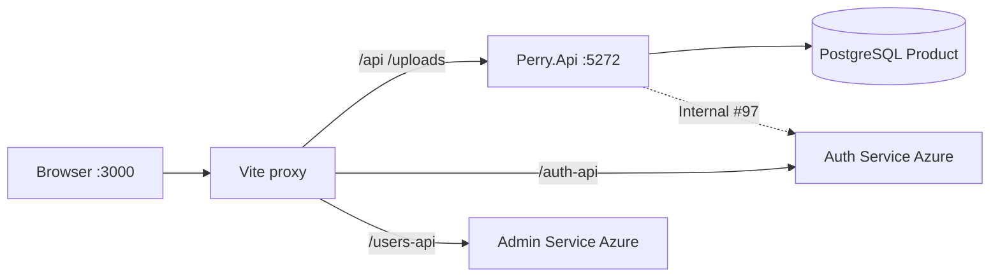

# Architecture Overview — Perry

**Изображения:** `diagram.png` (для слайдов) · `diagram.mmd` · `diagram.svg`

---

## Что изображено

Высокоуровневая архитектура дипломного проекта **Perry** (интернет-магазин).

- **Browser** — пользователь открывает React-витрину и встроенную админку
- **Vite (dev) / static FE** — React 19 SPA на порту **:3000**
- **Perry.Api (Product API)** — .NET 8 REST на **:5272** (каталог, корзина, заказы, отзывы)
- **Auth Service (Azure)** — login / register / JWT пользователей (отдельный микросервис)
- **Admin Service (Azure)** — управление пользователями админки (`/api/admin/users`)
- **PostgreSQL** — Product DB (EF Core + Npgsql; локально Docker или Supabase)

---

## Как это работает

1. Пользователь открывает `http://localhost:3000`.
2. Vite в dev проксирует запросы:
   - `/api`, `/uploads` → Product API `:5272`
   - `/auth-api` → Auth Service (Azure)
   - `/users-api` → Admin Service (Azure)
3. Product API читает/пишет каталог, корзину, заказы в **PostgreSQL**.
4. JWT выдаёт **Auth Service**; Product API **валидирует** тот же HS256 secret (iss/aud).
5. При необходимости Product вызывает Auth **Internal API (#97)** service-to-service (имена покупателей в заказах и т.п.).
6. Локально: `npm run dev` + `dotnet run` Perry.Api (+ Postgres/Supabase в `.env`).

