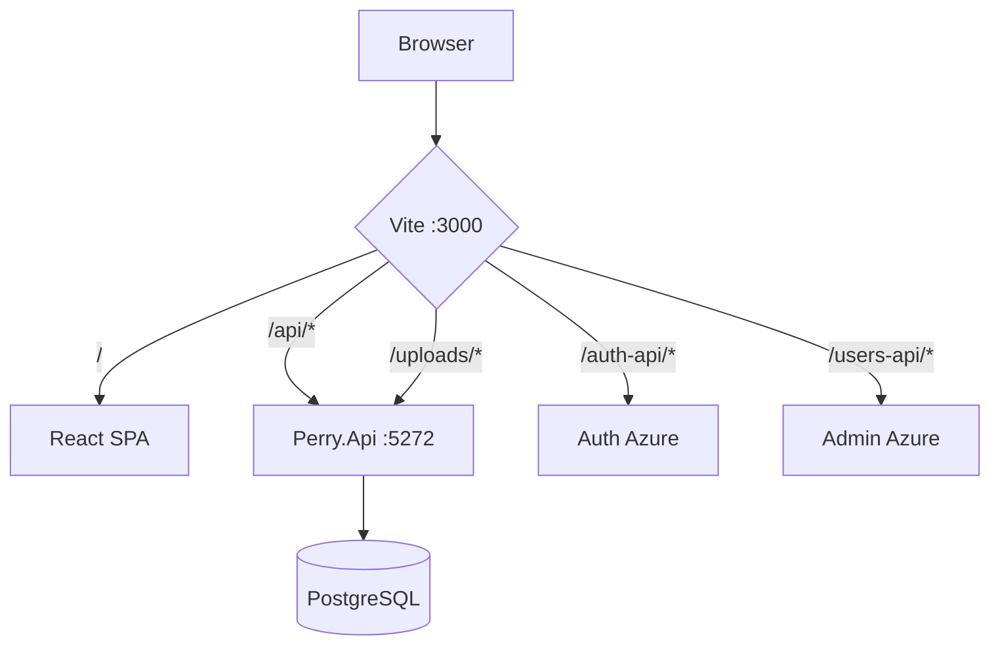

# Architecture Request Flow — Perry

**Изображения:** `diagram.png` (для слайдов) · `diagram.mmd` · `diagram.svg`

---

## Что изображено

Маршрутизация HTTP-запросов от браузера через **Vite proxy** к трём бэкендам.

---

## Как это работает

1. Браузер ходит только на `http://localhost:3000` (same-origin) — нет CORS-проблем с Azure Auth в dev.
2. Vite смотрит на путь:

| Путь | Куда | Что возвращается |
|------|------|------------------|
| `/`, статика | React SPA | HTML, JS, CSS |
| `/api/*` | Perry.Api `:5272` | JSON Product API |
| `/uploads/*` | Perry.Api `:5272` | медиафайлы |
| `/auth-api/*` | Auth Service Azure | login, register, me |
| `/users-api/*` | Admin Service Azure | admin users |

3. Клиент собирает URL в `src/api/client.ts` (`productApiUrl`, `authApiUrl`, `usersApiUrl`).
4. На prod Auth/Users могут идти напрямую (env `VITE_*`), без proxy.

