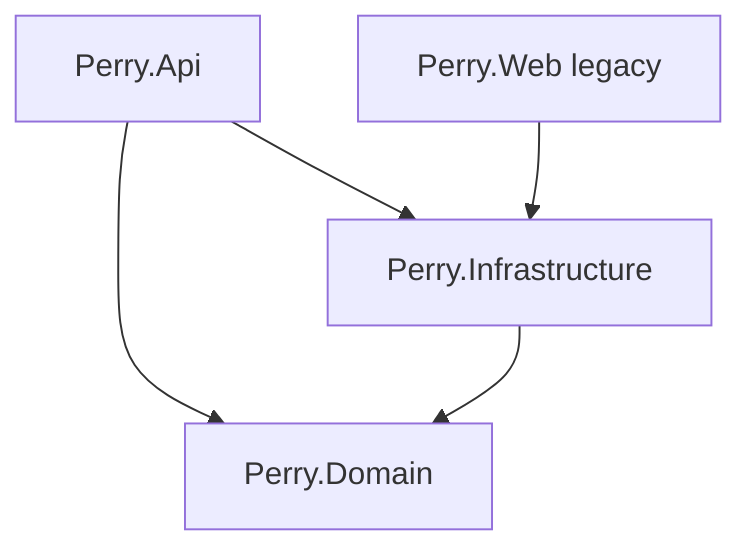

# Backend Structure — Perry

**Изображения:** `diagram.png` (для слайдов) · `diagram.mmd` · `diagram.svg`

---

## Что изображено

Структура solution **`Perry.sln`** (`My_Amazon2`).

| Проект | Роль |
|--------|------|
| **Perry.Api** | REST + Swagger, Controllers, JWT setup, CORS |
| **Perry.Domain** | Entities, enums, Result — без зависимостей от EF |
| **Perry.Infrastructure** | EF Core, Services, Repositories, AuthInternalClient, Storage |
| **Perry.Web** | Legacy Razor admin (не основной UI) |

Ключевые точки Api: `Program.cs`, `Controllers/`, `Auth/`, `Extensions/JwtAuthenticationService.cs`.

---

## Как это работает

1. **Program.cs** — создаёт WebApplication, Swagger, JWT, CORS (`:3000`, `:3001`), вызывает `AddInfrastructure`, миграции + `DbSeeder`.
2. **Controllers** — тонкий слой HTTP; бизнес-логика в Infrastructure Services.
3. **Domain** — `Product`, `Category`, `Order`, `Cart`, `ProductReview`, … без Users-таблицы (#94: UserId из JWT).
4. **Infrastructure** — `AppDbContext` (Npgsql), сервисы Cart/Order/Product/Category, диск для uploads.
5. Зависимости регистрируются в `DependencyInjection.cs`.

