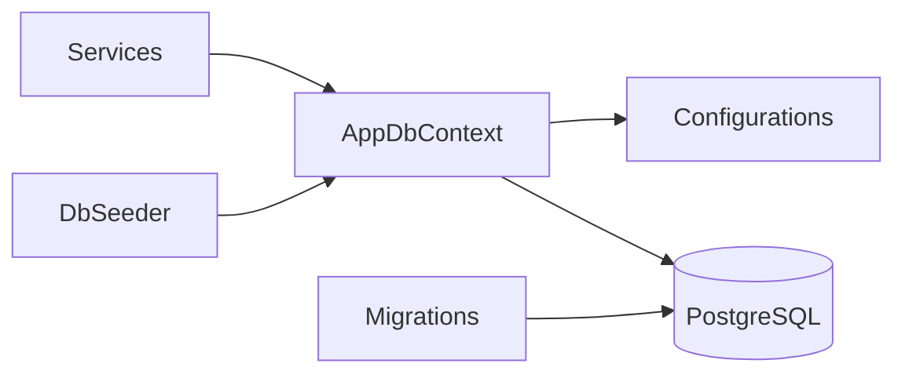

# Backend Database Layer — Perry

**Изображения:** `diagram.png` (для слайдов) · `diagram.mmd` · `diagram.svg`

---

## Что изображено

Слой данных Product API: **EF Core 8 + Npgsql → PostgreSQL**.

- **AppDbContext** — DbSet сущностей
- **Configurations/** — Fluent API (индексы, CHECK `"Rating"` и т.д.)
- **Migrations/** — в т.ч. `InitialPostgreSQL` (#A08)
- **DbSeeder** — демо-каталог, заказы, admin guid

---

## Как это работает

1. Строка подключения: `ConnectionStrings__DefaultConnection` из `.env` / окружения.
2. При старте Api: `MigrateAsync` + сид (если пусто).
3. Сервисы получают `AppDbContext` через DI (scoped).
4. Пользователи **не** хранятся в Product DB — только `UserId` (Guid из JWT).
5. Сущности: Product (+ Images, Attributes, About), Category (дерево), Cart/CartItem, Order/OrderItem, ProductReview (+ Tags, Grades, Images), WishlistItem, StockNotifyRequest.

