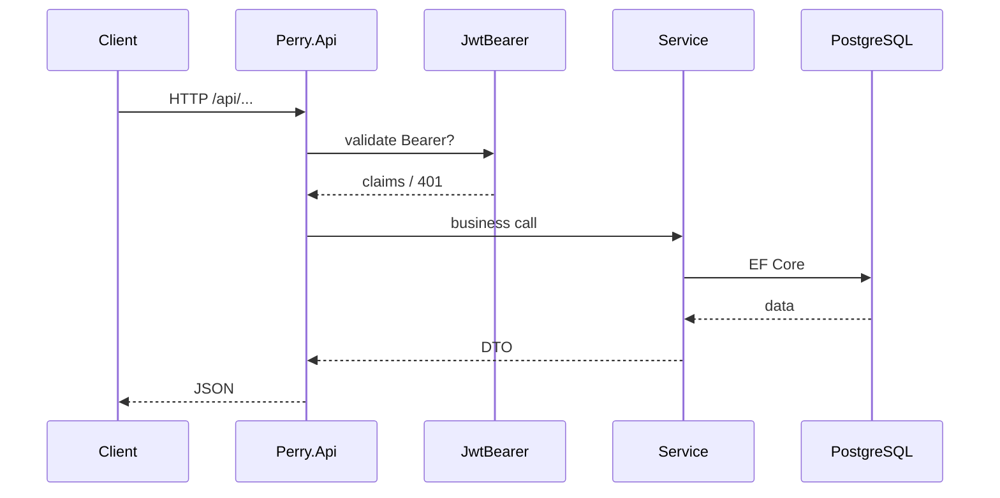

# Backend Request Flow — Perry

**Изображения:** `diagram.png` (для слайдов) · `diagram.mmd` · `diagram.svg`

---

## Что изображено

Путь одного HTTP-запроса внутри Product API.

---

## Как это работает

1. **CORS** — разрешает origin `localhost:3000` / `3001` и прод-домены.
2. **Authentication (JWT Bearer)** — если есть `Authorization`, валидирует подпись HS256, iss, aud.
3. **Authorization** — `[Authorize]` / политика Admin на чувствительных действиях.
4. **Controller** — парсит query/body, вызывает Service.
5. **Service / Repository** — бизнес-правила, EF-запросы.
6. **PostgreSQL** — чтение/запись.
7. Ответ JSON (или файл image/uploads).

Ошибки: 401 без/битый токен, 403 не Admin, 404 не найдено, ProblemDetails / кастомные Result.

