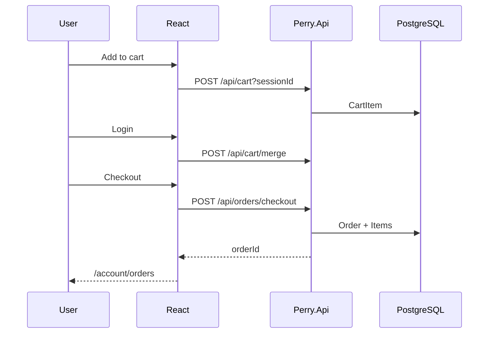

# Frontend Cart & Checkout Flow — Perry

**Изображения:** `diagram.png` (для слайдов) · `diagram.mmd` · `diagram.svg`

*(Аналог `12_frontend-player-flow` у Spotify Clone — ключевой пользовательский сценарий витрины.)*

---

## Что изображено

От добавления в корзину до заказа.

---

## Как это работает

1. Гость открывает сайт → CartContext создаёт `sessionId` (UUID) в localStorage.
2. Add to cart → `POST /api/cart?sessionId=…` (или update qty).
3. Login → `POST /api/cart/merge` с `{ sessionId }` — гостевая корзина склеивается с user.
4. `/cart` → «Proceed to checkout»: если нет user → `/login`.
5. `POST /api/orders/checkout` { sessionId, shippingAddress?, paymentType?, recipientName? }.
6. OrderService пишет Order + OrderItems, обновляет `UpdatedAtUtc` / last update (#A10).
7. Редирект: `/account/orders?open=<orderId>`.
8. Admin: `GET /api/orders/admin` + фильтры (#A09), `PUT …/status`.

