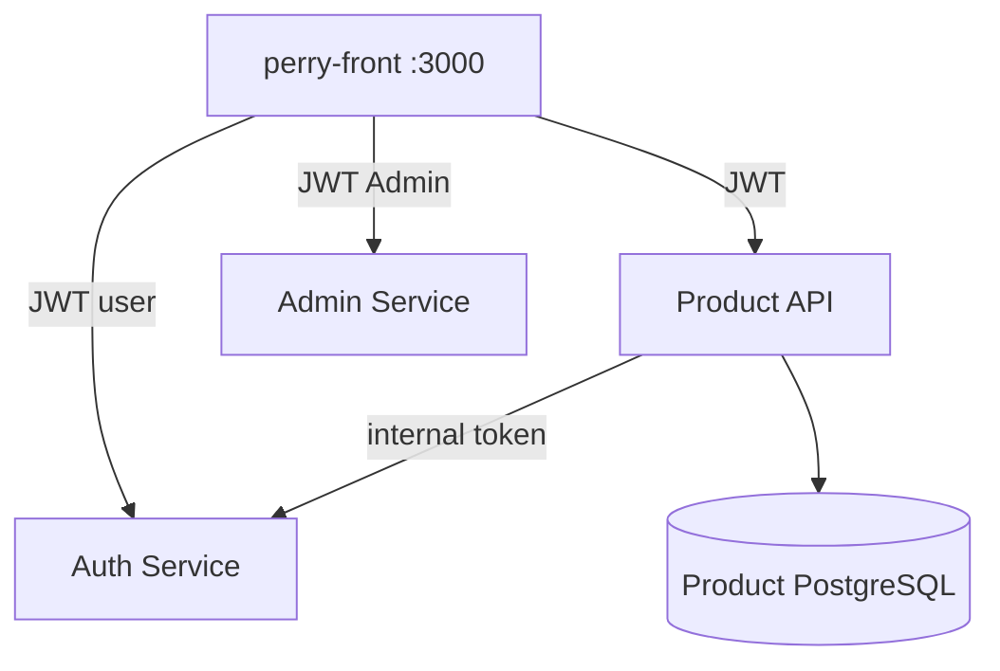

# Auth Microservices Architecture — Perry

**Изображения:** `diagram.png` (для слайдов) · `diagram.mmd` · `diagram.svg`

*(Аналог `13_jamendo-architecture` — внешняя интеграция.)*

---

## Что изображено

Стык трёх сервисов команды ITSTEP-PERRY (#94–#97).

| Сервис | Ответственность |
|--------|-----------------|
| **Auth Service** | Регистрация, login, JWT пользователя, Internal API |
| **Admin Service** | Список пользователей, роли, soft-delete (админка Users) |
| **Product API (наш)** | Каталог/заказы/отзывы; **нет** таблицы Users; валидирует JWT |

---

## Как это работает

1. **#94** — Users убраны из Product DB; везде `UserId` из claims.
2. **#95/#96** — общий HS256 secret, Issuer/Audience согласованы.
3. **#97** — Product как клиент Internal Auth (`AuthInternalClient`) для обогащения заказов именами.
4. FE Users page бьёт в **Admin Service**, не в Auth `/admin/users` и не в Product.
5. Документация стыков: `docs/СТЫКИ-ЛОКАЛЬНО.md`, `docs/AUTH-INTEGRATION.md`.

