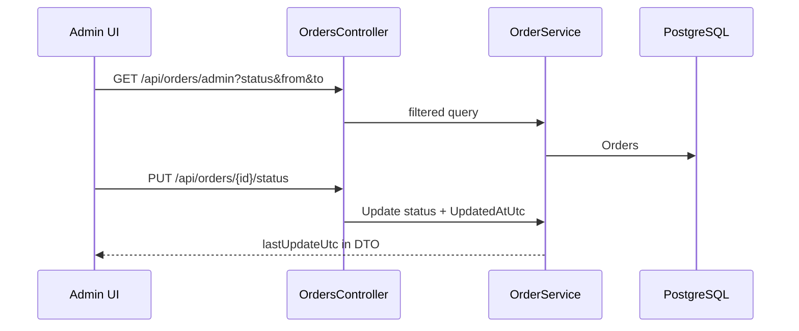

# Admin orders + last update (#A09 / #A10)

```mermaid
sequenceDiagram
  participant Admin as Admin UI
  participant API as OrdersController
  participant S as OrderService
  participant DB as PostgreSQL
  Admin->>API: GET /api/orders/admin?status&from&to
  API->>S: filtered query
  S->>DB: Orders
  Admin->>API: PUT /api/orders/{id}/status
  API->>S: Update status + UpdatedAtUtc
  S-->>Admin: lastUpdateUtc in DTO
```
