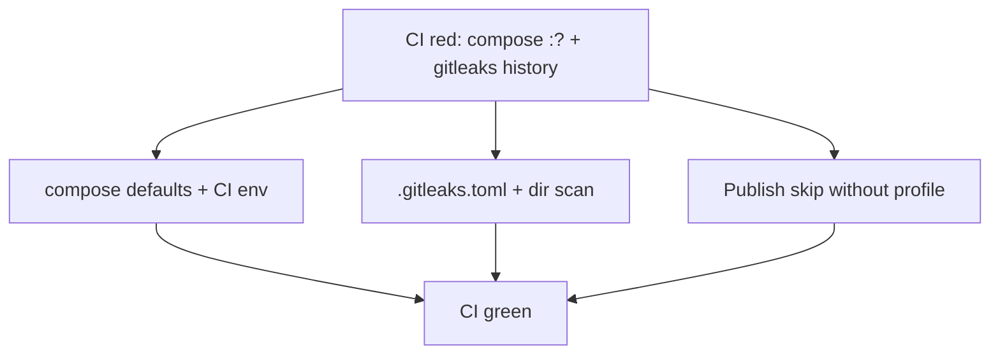

# CI fix flow

```mermaid
flowchart TD
  FAIL[CI red: compose :? + gitleaks history] --> FIX1[compose defaults + CI env]
  FAIL --> FIX2[.gitleaks.toml + dir scan]
  FAIL --> FIX3[Publish skip without profile]
  FIX1 --> OK[CI green]
  FIX2 --> OK
  FIX3 --> OK
```
