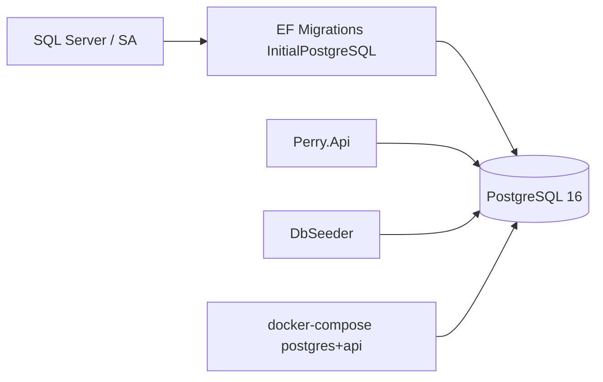

# PostgreSQL migration flow (#A08)

```mermaid
flowchart LR
  OLD[SQL Server / SA] --> MIG[EF Migrations InitialPostgreSQL]
  MIG --> PG[(PostgreSQL 16)]
  API[Perry.Api] --> PG
  SEED[DbSeeder] --> PG
  COMPOSE[docker-compose postgres+api] --> PG
```

**Суть:** Product API на Npgsql; CHECK `"Rating"`; `.env` + compose defaults для CI.
